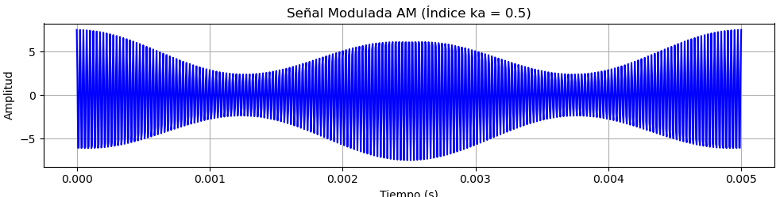
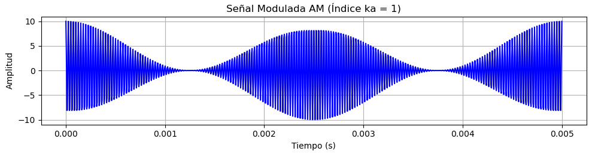
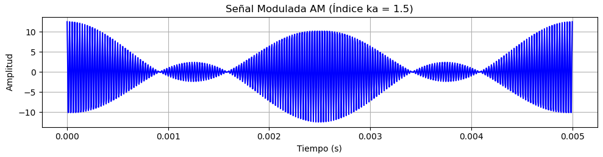
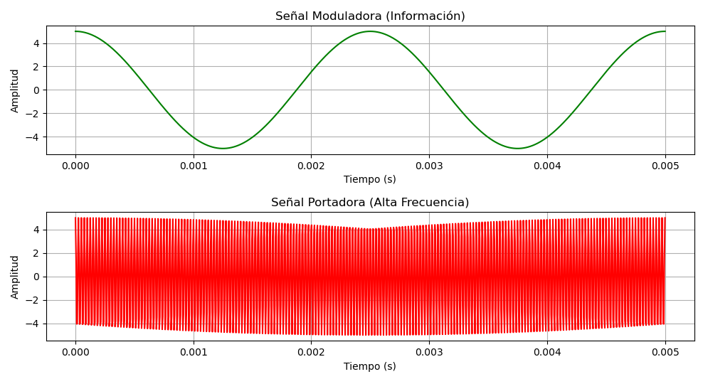
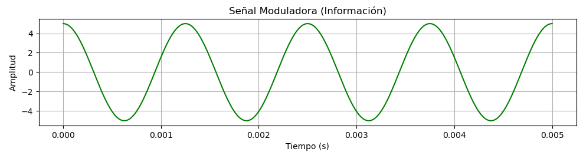
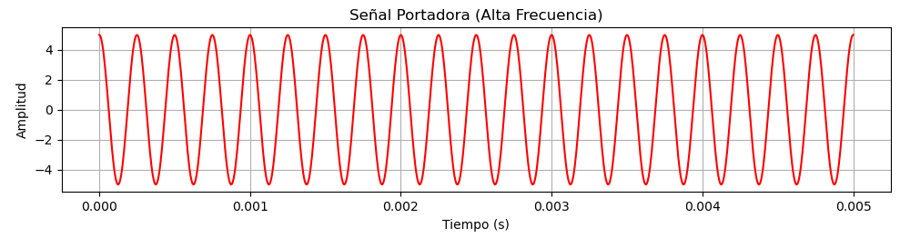

# Tarea 2 

# CONSIGNA B

## 3.1. ¿En qué se diferencia un medio guiado de un medio no guiado?

En ambos casos la comunicación se realiza mediante ondas electromagnéticas, pero:

- **Medio guiado:** las ondas se transmiten confinadas a lo largo de un camino físico (por ejemplo, par trenzado, cable coaxial o fibra óptica).
- **Medio no guiado** también llamados inalámbrico: proporciona un medio para transmitir las ondas electromagnéticas sin confinarlas a un camino físico, por ejemplo propagándose a través del aire, el mar,etc

## 3.2. ¿Cuáles son las diferencias entre una señal electromagnética analógica y una digital?

- **Señal analógica:** es aquella donda la intensidad de la señal varía de forma suave y continua en el tiempo, sin saltos ni discontinuidades.
- **Señal digital:** es aquella donde la intensidad se mantiene constante durante un intervalo de tiempo determinado, y luego cambia a otro valor constante
 
## 3.3. ¿Cuáles son las tres características más importantes de una señal periódica?

Una onda seno genérica (señal periódica por excelencia) queda representada por tres parámetros:

1. **Amplitud de Pico (A):** valor de pico/máximo que alcanza la señal
2. **Frecuencia (f):** es la razon a la que la señal se repite
3. **Fase (φ):** es la medida de la posicion relativa de la señal dentro de un periodo de la misma

## 3.4. ¿Cuántos radianes hay en 360°?

360° equivalen a **2π radianes**.

## 3.5. ¿Cuál es la relación entre la longitud de onda y la frecuencia en una onda seno?

La longitud de onda (λ) es la distancia entre dos puntos de igual fase en dos ciclos consecutivos. Si la señal se propaga a una velocidad *v*, la relación con el periodo T y la frecuencia f es:

λ = v·T, o de forma equivalente, **λ·f = v**

Es decir, la longitud de onda y la frecuencia son inversamente proporcionales: a mayor frecuencia, menor longitud de onda.

## 3.6. ¿Cuál es la relación entre el espectro de una señal y su ancho de banda?

El **espectro** de una señal es el conjunto (rango) de frecuencias que la componen. El **ancho de banda** es la anchura de ese espectro, es decir, la diferencia entre la frecuencia más alta y la más baja que lo constituyen (ancho de banda absoluto). Muchas señales tienen un ancho de banda infinito, pero concentran la mayor parte de su energía en una banda de frecuencias relativamente estrecha; a esa banda se la denomina **ancho de banda efectivo**.

## 3.7. ¿Qué es la atenuación?

**Atenuación** es la pérdida (disminución) de energía o potencia que sufre una señal a medida que se propaga a través de un medio de transmisión, ya sea guiado (cable, fibra) o no guiado (aire, espacio).

## 3.8. Defina la capacidad de un canal.

La **capacidad del canal** es la velocidad máxima (en bits por segundo) a la que se pueden transmitir datos de forma confiable a través de un canal de comunicación, bajo unas condiciones dadas.

## 3.9. ¿Qué factores clave afectan a la capacidad de un canal?

Existen cuatro conceptos interrelacionados:

- **La velocidad de transmisión de los datos:** velocidad, en bps, a la que se transmiten los datos.
- **El ancho de banda:** ancho de banda de la señal transmitida, limitado por el transmisor y por la naturaleza del medio (Hz/segundos).
- **El ruido:** nivel medio de ruido presente en el camino de transmisión.
- **La tasa de errores:** frecuencia con la que ocurren errores (un 1 recibido como 0, o viceversa).

# Ejercicios

## Ejercicio 3.1

**a)** En una configuración multipunto, sólo un dispositivo puede trasmitir cada vez, ¿por qué?

**Respuesta a):**
Porque al estar en multipunto, comparten el mismo medio físico. Si transmiten al mismo tiempo, las señales chocan (generan interferencias) y la información llega corrupta al receptor.

**b)** Hay dos posibles aproximaciones que refuerzan la idea de que, en un momento dado, sólo un dispositivo puede transmitir. En un sistema centralizado, una estación es la responsable del control y podrá transmitir o decidir que lo haga cualquier otra. En el método descentralizado, las estaciones cooperan entre sí, estableciéndose una serie de turnos. ¿Qué ventajas y desventajas presentan ambas aproximaciones?

**Respuesta b): Centralizado vs. Descentralizado**
* **Centralizado (una estación controla todo)**:
  * **Ventaja**: Mucho orden, elimina las colisiones de raíz.
  * **Desventaja**: Si se rompe el equipo central, se paraliza toda la red.
* **Descentralizado (las estaciones cooperan entre sí)**:
  * **Ventaja**: Es robusto frente a fallos; si un equipo se apaga, la red sigue funcionando.
  * **Desventaja**: Es más complejo de implementar y requiere procesar "mensajes extra" solo para coordinarse.

## Ejercicio 3.2

Una señal tiene una frecuencia fundamental de 1000 Hz. ¿Cuál es su periodo?

**Respuesta:**
* **Fórmula:** $T = 1/f$
* **Cálculo:** $T = 1 / 1000 = 0,001 \text{ s}$ (o $1 \text{ ms}$)

## Ejercicio 3.3

Simplifique las siguientes expresiones:
**a)** `sen(2πft - π) + sen(2πft + π)`
**b)** `sen(2πft) + sen(2πft - π)`

**Respuesta:**
Para simplificar estas expresiones usamos la **regla trigonométrica clave:** $\sin(x \pm \pi) = -\sin(x)$

**a)** $\sin(2\pi ft-\pi) + \sin(2\pi ft+\pi)$
$$-\sin(2\pi ft) - \sin(2\pi ft) = -2\sin(2\pi ft)$$

**b)** $\sin(2\pi ft) + \sin(2\pi ft-\pi)$
$$\sin(2\pi ft) - \sin(2\pi ft) = 0$$

## Ejercicio 3.4

El sonido se puede modelar mediante funciones sinusoidales. Compare la frecuencia relativa y la longitud de onda de las notas musicales. Piense que la velocidad del sonido es igual a 330 m/s y que las frecuencias de una escala musical son:

| Nota           |  DO   |  RE   |  MI   |  FA   |  SOL  |  LA   |  SI   |  DO   |
| :------------- | :---: | :---: | :---: | :---: | :---: | :---: | :---: | :---: |
| **Frecuencia** |  264  |  297  |  330  |  352  |  396  |  440  |  495  |  528  |

**Respuesta:**
* **Fórmula:** $\lambda = v/f$
* **Relación:** Son **inversamente proporcionales**; a mayor frecuencia, menor longitud de onda ($\lambda$).
* **Ejemplos representativos:**
  * **DO:** $\lambda = 330 / 264 = 1,25 \text{ m}$
  * **LA:** $\lambda = 330 / 440 = 0,75 \text{ m}$
  * **DO (octava alta):** $\lambda = 330 / 528 = 0,625 \text{ m}$

## Ejercicio 3.5

Si la curva trazada con una línea continua de la Figura 3.17 representa al `sen(2πt)`, ¿qué función corresponde a la línea discontinua? En otras palabras, la línea discontinua se puede expresar como `A sen(2πft + φ)`; ¿qué son A, f y φ?

**Respuesta:**
* **Amplitud ($A$):** $2$. El pico de la onda discontinua llega exactamente hasta la marca de 2,0.
* **Frecuencia ($f$):** $2\text{ Hz}$. Completa un ciclo entero en 0,5 segundos ($T=0,5$), por ende entran 2 ciclos completos en un segundo.
* **Fase ($\phi$):** $\pi$ radianes. La onda arranca en 0 pero baja hacia los negativos; esto equivale a una función seno invertida (un desfasaje exacto de $180^\circ$ o $\pi$).

**Resultado final:**
$$s(t) = 2\sin(4\pi t + \pi)$$

## Ejercicio 3.10

En un sistema de transmision real las implicaciones son:

* **El Limite Fisico:**
Debido a que fisicamente es imposible diseñar un transmisor o receptor con un ancho de banda infinito. Todo medio fisico actua naturalmente como un filtro pasa-bajos lo que en cierta frecuencia cortara abruptamente los componentes de alta frecuencia de la señal original.

* **Deformacion del Pulso:**
Las frecuencias mas altas son las responsables de formar los cambios abruptos. Al pasar por un canal real que elimina esas frecuencias altas el pulso que llega al receptor pierde sus bordes cuadrados, se vuelve una onda redonda y ensanchada.

* **Interferencia Intersimbolica (ISI):**
Como el canal elimina las altas frecuencias y el pulso se ensancha en el tiempo, la "cola" de la señal de un bit invade el espacio de tiempo asignado al siguiente bit. Si se intenta enviar datos demasiado rápido, los pulsos redondos se superpondrán unos con otros hasta el punto en que el receptor ya no podrá distinguir dónde termina un "1" y dónde empieza un "0".

## Ejercicio 3.11

Un codigo de 6 bits solo permite calcular 2^6 = 64 combinaciones unicas, para solucionar esto y asignar los 100 caracteres se implemento un diseño basado en estados y se lograba lo siguiente:

* **Caracteres de Desplazamiento:**
Se sacrifica intencionalmente una (o dos) de las 64 combinaciones disponibles para que no represente un caracter imprimible, sino para que funcione como un comando interno de "cambio de estado".

* **Paginas de Codigos:**
Al transmitir el caracter especial el sistema le indica al receptor que el significado de las 64 combinaciones siguientes cambia por completo, pasando a leer una "pagina" de caracteres alternativos. Al reservar un codigo para alternar entre ambos estados quedan 63 combinaciones utiles para datos, multiplicar esto por ambos bancos se obtienen 126 posibles representaciones.

## Ejercicio 3.12 - 3.15
### a)
Es solo el producto de los elementos que componen la señal en un segundo:
- 480 X 500 = 240000 pixeles.
- Con 32 niveles de intensidad -> log_2(32) = 5 bits/pixel
- Con 30 imagenes por segundo -> R = 240000 x 5 x 30 = 36000000 bps

Siendo el resultado 36Mbps

### b)
Se usa el teorema de Shannon-Hartley, hacemos conversion en relacion a la señal-ruido (S/N)

35 = 10log_10(S/N)
S/N = 10^3.5 = 3162.28

Calculo de capacidad, ancho de banda (B)

B = 4.5 x 10^6 Hz
C = B log_2(1 + S/N)
C = 4.5 x 10^6 x log_2(1 + 3162.28) = 5221500bps

Dando una capacidad maxima del canal de 52.3Mbps.


# Consigna D: Modulación en AM en Python

## Código de Modulación AM (basado en el siguiente link)

https://programacionpython80889555.wordpress.com/

El siguiente código implementa la modulación AM utilizando la librería `numpy` para los cálculos trigonométricos y `matplotlib` para la generación de los gráficos.

```python
import numpy as np
import matplotlib.pyplot as plt

fp = 40000     # Frecuencia de la señal portadora
fm = 400       # Frecuencia de la señal moduladora

Ap = 5         # Amplitud de la portadora y moduladora

ka = 1         # ka = 1 (100% modulación), ka < 1 (submodulación), ka > 1 (sobremodulación)

t = np.linspace(0, 0.005, 1000)

moduladora = Ap * np.cos(2 * np.pi * fm * t)

portadora = Ap * np.cos(2 * np.pi * fp * t)

am = Ap * (1 + ka * np.cos(2 * np.pi * fm * t)) * np.cos(2 * np.pi * fp * t)

plt.figure(figsize=(10, 8))

# Gráfico 1: Señal Moduladora
plt.subplot(3, 1, 1)
plt.plot(t, moduladora, color='green')
plt.title('Señal Moduladora (Información)')
plt.xlabel('Tiempo (s)')
plt.ylabel('Amplitud')
plt.grid(True)

# Gráfico 2: Señal Portadora
plt.subplot(3, 1, 2)
plt.plot(t, portadora, color='red')
plt.title('Señal Portadora (Alta Frecuencia)')
plt.xlabel('Tiempo (s)')
plt.ylabel('Amplitud')
plt.grid(True)

# Gráfico 3: Señal Modulada AM
plt.subplot(3, 1, 3)
plt.plot(t, am, color='blue')
plt.title(f'Señal Modulada AM (Índice ka = {ka})')
plt.xlabel('Tiempo (s)')
plt.ylabel('Amplitud')
plt.grid(True)

plt.tight_layout()
plt.show()
```

## Pruebas y Análisis al Variar los Parámetros

A continuación, se detalla el análisis del comportamiento de la señal modulada en amplitud (AM) al realizar pruebas variando los parámetros de amplitud ($A_p$), frecuencias ($f_p$, $f_m$) y el índice de modulación ($k_a$).


### A. Variación del Índice de Modulación ($k_a$)

El índice de modulación $k_a$ (también denotado como $m$) define la relación entre la variación de la amplitud de la envolvente y la amplitud de la portadora pura. Es el parámetro crítico que determina la calidad y fidelidad de la transmisión.

1. **Submodulación ($k_a < 1$, ejemplo: $k_a = 0.5$):**



   * **Comportamiento:** La amplitud de la portadora varía de forma proporcional a la señal moduladora, pero en sus puntos mínimos la señal nunca llega a tocar el nivel cero.
   * **Conclusión:** Es una transmisión segura. La envolvente preserva la forma exacta del mensaje original, lo que permite demodularla fácilmente mediante receptores sencillos (como un detector de envolvente con diodo) sin introducir distorsión.

2. **Modulación Crítica o Completa ($k_a = 1.0$ o $100\%$):**



   * **Comportamiento:** Los valles de la envolvente llegan exactamente a tocar el eje de amplitud cero ($0\text{ V}$) en los mínimos de la señal moduladora.
   * **Conclusión:** Representa el estado óptimo de transmisión en AM estándar, ya que se aprovecha al máximo la potencia de la portadora para transportar la información útil sin llegar a distorsionar la señal.

3. **Sobremodulación ($k_a > 1$, ejemplo: $k_a = 1.5$):**



   * **Comportamiento:** En los valles del mensaje, la envolvente intenta tomar valores negativos, lo que causa un cruce por cero, una inversión de fase de $180^\circ$ en la portadora y la cancelación/recorte del pico inferior.
   * **Conclusión:** Genera **distorsión por sobremodulación** (recorte de envolvente) en el receptor. Además, produce componentes armónicas no deseadas en el espectro frecuencial, lo que causa interferencia en los canales de radio adyacentes (esparcimiento espectral).


### B. Variación de las Frecuencias ($f_p$ y $f_m$)

La relación entre la frecuencia de la portadora y la de la moduladora determina la definición y resolución con la que se transmite la información:

1. **Relación de Frecuencias ($f_p \gg f_m$):**



   * **Comportamiento:** Para una modulación AM efectiva, la frecuencia de la portadora ($f_p$) debe ser significativamente mayor que la frecuencia de la señal de información ($f_m$). 
   * **Observación:** En la prueba realizada con $f_p = 40000\text{ Hz}$ y $f_m = 400\text{ Hz}$, la portadora oscila 100 veces dentro de un solo período de la señal moduladora, dibujando de forma clara y nítida el contorno de la envolvente.

2. **Aumento de la Frecuencia Moduladora ($f_m$):**



   * **Comportamiento:** Al aumentar $f_m$, los ciclos de la envolvente ocurren con mayor rapidez en el tiempo (disminuye su período $T_m = 1/f_m$).
   * **Efecto Espectral:** Incrementa el ancho de banda requerido para la transmisión, el cual en AM equivale a $BW = 2 \cdot f_m$.

3. **Disminución de la Frecuencia Portadora ($f_p$):**



   * **Comportamiento:** Si $f_p$ se aproxima demasiado a $f_m$, la cantidad de ciclos de la portadora dentro de la envolvente es insuficiente.
   * **Conclusión:** La señal modulada pierde definición visual y técnica, dificultando la separación de las señales en el proceso de demodulación en el receptor.

---

### C. Variación de la Amplitud ($A_p$)

* **Comportamiento:** Incrementar o reducir el valor de $A_p$ escala proporcionalmente el nivel de tensión (voltaje) de todas las señales del sistema.
* **Impacto:** Si la potencia del emisor aumenta, la relación señal-ruido ($SNR$) en el receptor mejora, lo que permite cubrir mayor alcance geográfico, manteniendo constante la profundidad de modulación si $k_a$ no varía.
