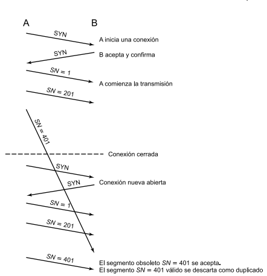
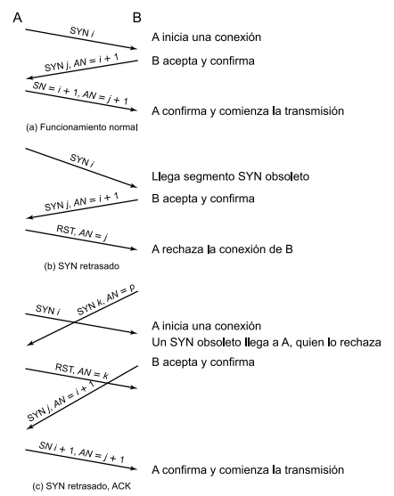

# 20.6

**Explique los mecanismos de diálogo en dos y tres pasos.**

Como con otros mecanismos de protocolo, el establecimiento de la conexión debe tener en cuenta la falta de fiabilidad de un servicio de red. Recuérdese que el establecimiento de la conexión requiere el intercambio de SYN, un procedimiento llamado a veces diálogo en dos pasos.

## Diálogo en dos pasos

A envía un SYN con su número de secuencia inicial *i* y espera que B responda con otro SYN que confirme la conexión. Si se pierde alguno de los dos, un temporizador de retransmisión de SYN hace que A lo reenvíe, y los SYN duplicados se ignoran una vez establecida la conexión.

Ejemplo de diálogo en dos pasos:

## Diálogo en tres pasos

El establecimiento de la conexión en TCP siempre utiliza un diálogo en tres pasos.

La conexión se declara establecida solo cuando ambos SYN fueron confirmados (por eso aparece el estado SYN RECEIVED). Con esto los casos problemáticos se resuelven:

* Si llega a B un SYN *i* viejo, B responde (SYN *j*, AN = *i* + 1). A, que no pidió ninguna conexión, contesta **RST con AN = *j***. Ese AN es esencial para que un RST viejo no cancele una conexión legítima.
* Si llega un SYN/ACK viejo en medio de una conexión nueva, no hace daño, porque su AN no coincide con el ISN actual.

Ejemplo de diálogo en tres pasos:

