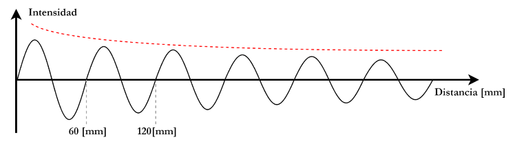

# Ondas Electromagnéticas

## Conceptos Teóricos

### Ondas Electromagnéticas
Una onda electromagnética es la propagación de un campo eléctrico y un campo magnético en el espacio. A diferencia de las ondas mecánicas, que requieren un medio material, puede propagarse en el vacío.

Las principales características de una onda son:

- **Amplitud:** representa la intensidad de la onda.
- **Longitud de onda ($\lambda$):** distancia entre dos puntos idénticos consecutivos de la onda, por ejemplo, dos máximos.
- **Frecuencia ($f$):** número de períodos completados por segundo, expresada en hertz (Hz).
- **Período ($T$):** duración de un período.

La relación entre la frecuencia y la longitud de onda es:
$$c = \lambda f$$

donde $c$ es la velocidad de la luz:
$$c \approx 3 \times 10^8 \text{ m/s}$$

### Modulación y Demodulación
- **Modulación:** consiste en modificar una característica de una onda portadora para transmitir información. Por ejemplo, se puede modificar su amplitud, su frecuencia o su fase.
- **Demodulación:** es la operación inversa; permite recuperar la información transportada por la señal modulada en el receptor.

### Señales de Tiempo Continuo
Una señal de tiempo continuo está definida en cada instante. Puede tomar un número infinito de valores entre dos instantes.

Por ejemplo, una onda senoidal es una señal continua:
$$s(t) = A \sin(2\pi f t)$$

### Señales de Tiempo Discreto
Una señal de tiempo discreto solo está definida en ciertos instantes precisos. En el ámbito digital, la información se representa generalmente mediante un conjunto de valores, por ejemplo, 0s y 1s.

---

## Inciso a

En el siguiente gráfico podemos observar una onda electromagnética cuya intensidad varía en función de la distancia. La señal presenta un comportamiento periódico, con una forma aproximadamente sinusoidal.

También podemos observar que la amplitud de la onda va disminuyendo a medida que aumenta la distancia. Esto representa una pérdida de intensidad del señal durante su propagación, fenómeno que se conoce como **atenuación**.

---

## Inciso b

A partir del gráfico podemos determinar que:

**λ = 60 mm = 0,060 m**

Considerando que la onda viaja a la velocidad de la luz:

**c = 3 × 10⁸ m/s**

Utilizamos la relación **c = λ × f**:

**f = c / λ = (3 × 10⁸) / 0,060 = 5 × 10⁹ Hz = 5 GHz**

Entonces, la onda tiene una **longitud de onda de 60 mm** y una **frecuencia de 5 GHz**.

---

## Inciso c

La frecuencia obtenida es de **5 GHz**, por lo que la onda pertenece a la región de las **ondas de radio**, dentro de las frecuencias de microondas.

Según la clasificación de la ITU, la frecuencia de 5 GHz se encuentra dentro de la banda **SHF (Super High Frequency)**, que comprende aproximadamente desde 3 GHz hasta 30 GHz.

Por lo tanto:

- **Región:** Microondas / ondas de radio.
- **Banda:** SHF (Super High Frequency).
- **Frecuencia:** 5 GHz.

Tal como se puede observar en la siguiente representación del espectro electromagnético:

---

## Inciso d

Dentro de esta banda existen diferentes dispositivos y sistemas utilizados para comunicaciones de datos.

Un ejemplo es el **Wi-Fi de 5 GHz**, utilizado en routers y puntos de acceso inalámbricos para conectar computadoras, notebooks, teléfonos y otros dispositivos a una red.

---

## Inciso e

La línea de trazos roja representa la **atenuación de la señal**.

Podemos observar que, a medida que aumenta la distancia, la amplitud de la onda disminuye progresivamente. Esto significa que la intensidad o potencia del señal recibida es menor cuanto más lejos se encuentra del emisor.

---

## Inciso f

Sí, este fenómeno afecta al dispositivo mencionado anteriormente, es decir, a una conexión **Wi-Fi de 5 GHz**.

En una situación cotidiana podemos observar que, cuando nos alejamos del router, la señal Wi-Fi se vuelve más débil. Esto puede producir una disminución de la velocidad de conexión, una mayor cantidad de errores en la transmisión o incluso la pérdida de conexión cuando la señal es demasiado débil.

También pueden influir otros factores, como las paredes y otros obstáculos que se encuentran entre el router y el dispositivo.

---

## Inciso g

* **i) Telefonía celular:** sí, la atenuación afecta a las transmisiones de telefonía celular. La señal inalámbrica pierde intensidad durante su propagación y puede verse además afectada por obstáculos y edificios. Una señal más débil puede producir una peor calidad de comunicación o una reducción del rendimiento de la conexión.

* **ii) Cable coaxial:** sí, la atenuación también afecta a las transmisiones mediante cable coaxial. El señal eléctrico pierde parte de su energía mientras se propaga por el cable. Esta pérdida depende, entre otros factores, de la longitud del cable y de la frecuencia utilizada.

* **iii) Fibra óptica:** sí, la fibra óptica también presenta atenuación. En este caso la información se transmite mediante señales luminosas y la potencia óptica disminuye durante la propagación. Sin embargo, la fibra óptica presenta una atenuación muy baja, lo que permite realizar transmisiones de datos a grandes distancias.
