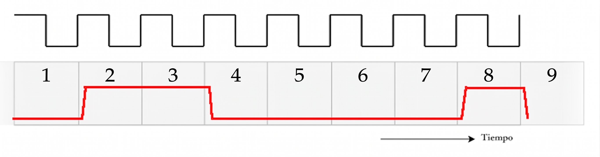

## Inciso a
Se observa que la dirección de la comunicación es de tipo unidireccional y de modo sincrónico debido a la presencia de una señal de clock.

## Inciso b
No, este sistema presenta restricciones estrictas para comunicación bidireccional según el diagrama aunque cabe destacar que el modo sincrónico ofrece mayor velocidad que el modo asincrónico debido a la auscencia de carácteres de control aumentando asi la carga útil del mensaje y reduciendo la cantidad de bits necesarios para transmitir un mismo mensaje.

## Inciso c
Nuestro grupo se llama auratech. La letra "a" en ASCII es el 97 en decimal, 61 en hexa. Descomponiendo el 61 en 2 nibbles donde el 60 sera representado por los 4 bits superiores (0110) y el 1 por los 4 bits inferiores(0001).

## Inciso d

Se debería medir (muestrear) la señal en las marcas temporales $T_0, T_1, T_2, T_3, T_4, \dots,T_n$ es decir, en el centro de cada intervalo de bit (o la mitad del período de reloj) esto debido a que la medición justo en el cambio de clock de 0 a 1 podria devolvernos un valor intermedo inconsistente como por ejemplo si leyéramos 0.5, ¿sería un 0 o un 1?.
