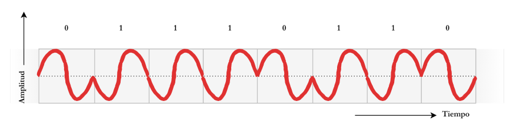
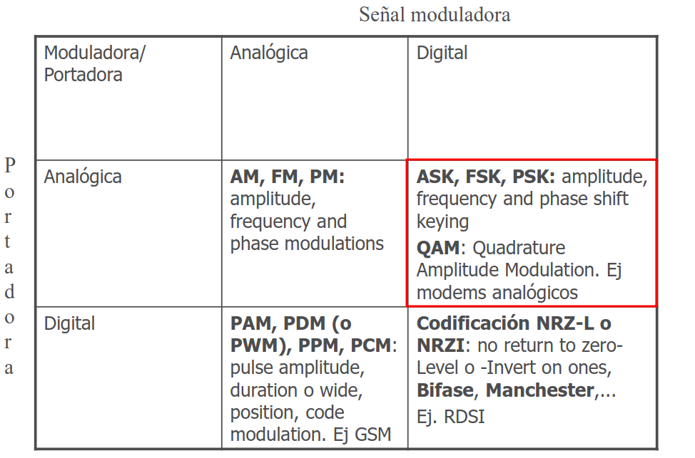

# Transmisión de señales
No es conveniente transmitir una señal escalonada de manera inalámbrica debido a factores físicos y del canal de transmisión.

Por el teorema de Fourier, una señal con transiciones abruptas requiere una cantidad infinita de frecuencias altas para mantener sus esquinas rectas. El canal inalámbrico tiene un ancho de banda limitado, lo que actúa como un filtro que recorta estas frecuencias. Como resultado, la señal se deforma y sus flancos se redondean, provocando que los pulsos se solapen (Interferencia Entre Símbolos).

Además, para que una antena irradie energía de manera eficiente, su tamaño físico debe ser proporcional a la longitud de onda de la señal. Como las señales escalonadas puras tienen componentes de muy baja frecuencia (es decir, longitudes de onda inmensas), intentar transmitirlas directamente requeriría construir antenas de kilómetros de longitud.

Transmitir en frecuencias bajas por el espacio libre genera una enorme atenuación y hace que la señal sea extremadamente vulnerable al ruido electromagnético del ambiente. El receptor sería incapaz de distinguir de forma confiable los niveles lógicos que representan los bits.

Por estos motivos, la información digital no se envía por el aire "cruda", sino que se recurre a la modulación, donde se alteran los parámetros (amplitud, frecuencia o fase) de una onda electromagnética (portadora) para que transporte los datos a través de antenas de tamaño práctico y en bandas de frecuencia reguladas.

## Inciso a
Se está representando PSK (Phase Shift Keying o Modulación por Desplazamiento de Fase).
Se puede observar que la amplitud y la frecuencia de la onda portadora se mantienen constantes en todo momento. Lo que cambia es la fase de la onda. Cuando el bit es "0", la onda inicia su ciclo "subiendo" (fase 0°). Cuando el bit es "1", la fase se invierte y la onda inicia su ciclo "bajando".

## Inciso b

## Inciso c

**ASK** (Amplitude Shift Keying - Modulación por Desplazamiento de Amplitud): Mantiene la frecuencia y la fase de la onda constantes, pero altera su amplitud. Por ejemplo, se transmite la portadora a una amplitud máxima para representar un "1" lógico, y a una amplitud menor para representar un "0".

**FSK** (Frequency Shift Keying - Modulación por Desplazamiento de Frecuencia): Mantiene la amplitud y la fase constantes, pero alterna entre dos frecuencias portadoras distintas para diferenciar los estados lógicos "0" y "1".

**QAM** (Quadrature Amplitude Modulation - Modulación de Amplitud en Cuadratura): Es una técnica combinada y de orden superior. Modifica simultáneamente la amplitud y la fase de la señal portadora (combinando los principios de ASK y PSK). Esto permite definir múltiples estados o "símbolos", logrando transmitir varios bits en un solo ciclo de reloj, lo cual la convierte en el estándar de las redes inalámbricas modernas de alta capacidad (Ej. Wi-Fi).

## Inciso d

El Bit Error Rate (BER), o Tasa de Error de Bits, es una métrica fundamental en telecomunicaciones que cuantifica la confiabilidad de un canal de comunicación digital. Se define como la relación entre la cantidad de bits que se reciben de manera incorrecta (alterados por el ruido o la interferencia) y el número total de bits transmitidos durante un período de tiempo determinado.

$$BER = \frac{\text{Número de bits recibidos con error}}{\text{Número total de bits transmitidos}}$$

El objetivo en cualquier red de computadoras es mantener el BER lo más bajo posible y la modulación PSK cumple con ello. La información está codificada en la fase de la onda. El ruido eléctrico que se suma en el trayecto casi no altera el ángulo de fase de la señal. Por eso, la modulación PSK requiere mucha menos potencia de señal para lograr una tasa de error baja comparada con las otras (FSK y ASK).
