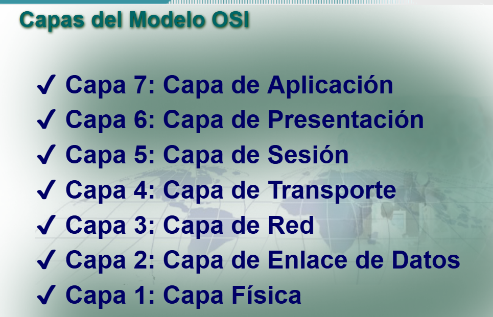
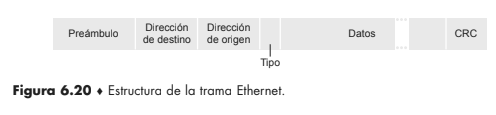
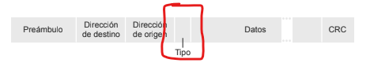

# Ejercicio 1 Resuelto

## Inciso a

> a) ¿Qué función cumple la capa de enlace dentro del modelo OSI? ¿Qué tipo de comunicación resuelve?

**RTA:**

Mientras que la capa física proporciona exclusivamente un servicio de transmisión de datos, la capa de enlace de datos intenta hacer que el enlace físico sea confiable. El principal servicio proporcionado por la capa de enlace de datos a las capas superiores es el de detección y control de errores. Se encarga de transportar los bits que entrega la capa física organizándolos en unidades llamadas **tramas**, y de garantizar que esa transferencia entre dos dispositivos conectados directamente por el mismo medio sea confiable.

Se ocupa del:

* Direccionamiento fisico
* Topologia de red
* Acceso al medio
* Entrega ordenada de Tramas
* Control del Flujo

*Fuente imagen: ([www.elingesor.com/archivos/909](https://www.elingesor.com/archivos/909))*

*Fuente Imagen presentacion Clase teorica OSI*

---

## Inciso b

> b) ¿Qué es una dirección MAC? ¿En qué se diferencia de una dirección IP?

La direccion MAC es un identificador unico de 48 bits que el fabricante le asigna a la tarjeta o dispositivo de red.

A diferencia de la direccion ip la **MAC tiene estructura plana** (no jerárquica) y **no cambia nunca**, sin importar a dónde se lleve el dispositivo, que la **IP tiene estructura jerárquica** (parte de red + parte de host) y **debe cambiar** cuando el dispositivo se mueve a otra red.

---

## Inciso c

> c) ¿Qué es una trama Ethernet? Identificar sus principales campos y explicar brevemente para qué sirve cada uno.

Es la unidad de datos de la capa de enlace en una red Ethernet: cuando un host quiere enviar un datagrama IP a otro host de la misma LAN, el adaptador emisor lo encapsula dentro de esta trama y la pasa a la capa física; el adaptador receptor la recibe, extrae el datagrama y lo entrega a la capa de red.

se identifican 6 campos:

1. Preambulo: Primeros 7 bytes que sirven para "despertar" a los receptores y sincronizar el clock con el del emisor
2. Direccion de destino: la MAC del adaptador al que va dirigida la trama, si el receptor detecta que coincide con su propia MAC, pasa los datos hacia arriba, sino , se descarta
3. Direccion de origen: MAC del emisor
4. Tipo:Indican protocolos de red 2bytes
5. Datos_Transporta el datagrama IP
6. CRC: Comprobacion de redundancia ciclica

*Fuenta de la Imagen libro Kurose-Ross*

---

## Inciso d

> d) ¿Qué información permite determinar qué protocolo de capa superior está transportando una trama Ethernet?

El campo de Tipo (2bytes) es el que permite determinar el protocolo

Ademas permite a Ethernet multiplexar los protocolos de la capa de red. Para comprender esto, tenemos que tener en cuenta que los hosts pueden utilizar otros protocolos de la capa de red además de IP.

Cada protocolo de capa superior tiene un numero de tipo estandarizado

