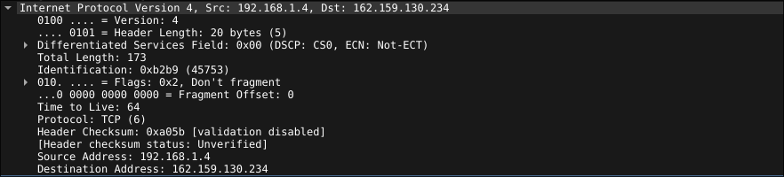

# Ejercicio 2

## Inciso a

La direccion de Origen (source) pertenece a la tarjeta de red de mi laptop y la del Destino (Destination) pertenece a la interfaz del router local.

## Inciso b

Podemos ver que las direcciones IP son, Source Address 192.168.1.4 y la Destination Address 162.159.130.234.
