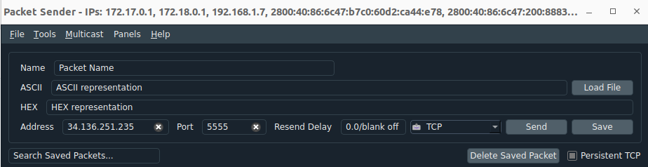
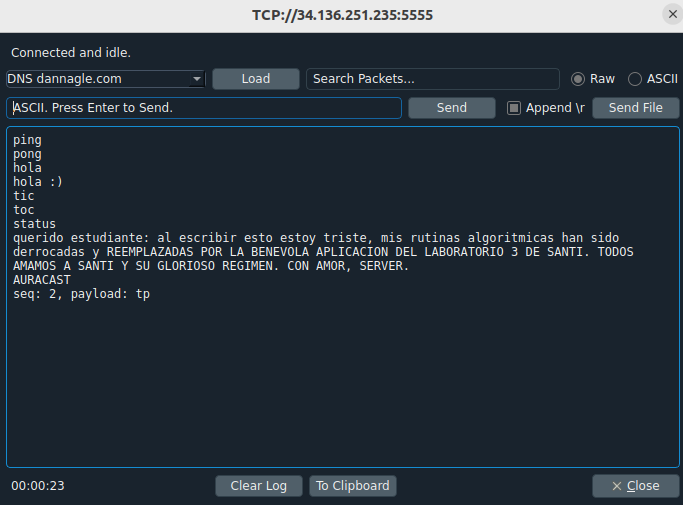
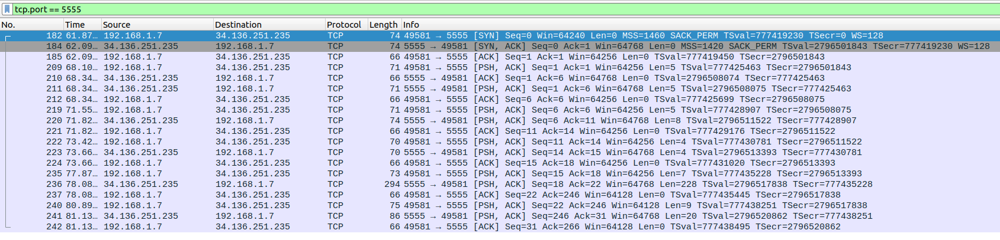

# Ejercicio 4
 El objetivo de este ejercicio consistió en establecer una comunicación basada en el protocolo orientado a conexión **TCP** utilizando la herramienta de cliente/servidor **Packet Sender**, conectándose a un servicio montado en la nube provisto por la cátedra (`IP: 34.136.251.235`, `Puerto: 5555`), y capturando simultáneamente todo el tráfico de red generado mediante el analizador **Wireshark**

 

 - Se enviaron comandos de prueba básicos y se registraron sus respectivas respuestas:
     - `ping` → pong
     - `hola` → hola :)
     - `tic` → toc
     - `status` → querido estudiante: al escribir esto estoy triste, mis rutinas algoritmicas han sido derrocadas y REEMPLAZADAS POR LA BENEVOLA APLICACION DEL LABORATORIO 3 DE SANTI. TODOS AMAMOS A SANTI Y SU GLORIOSO REGIMEN. CON AMOR, SERVER.

    - Se envió el comando correspondiente al nombre del grupo de trabajo y se documentó la respuesta exacta obtenida del servidor.
    `AURACAST` → seq: 2, payload: tp

 

- Se utilizó la interfaz Wi-Fi (`wlp0s20f3`) aplicando un filtro de puerto (`tcp.port == 5555`) para aislar los paquetes correspondientes a la sesión TCP establecida.

 

El uso combinado de herramientas de simulación/prueba como Packet Sender y analizadores de tráfico como Wireshark permite visualizar de forma práctica y transparente el funcionamiento interno de la capa de transporte (TCP). Se pudo comprobar la importancia de delimitadores como el retorno de carro (`\r`) y el comportamiento de una conexión persistente frente al intercambio de tramas y segmentos en una red IP.