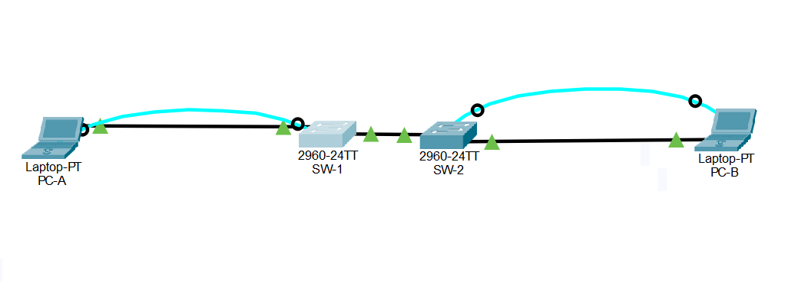
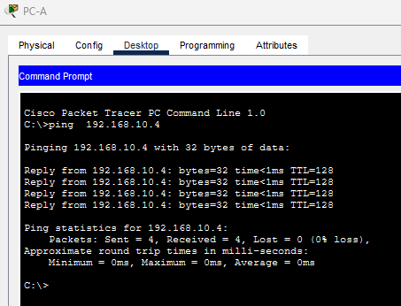
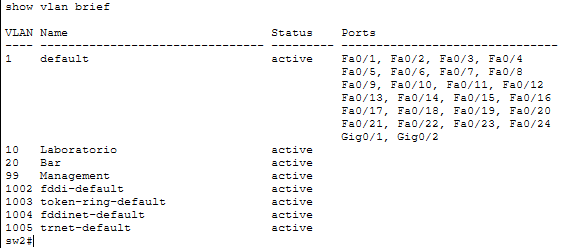
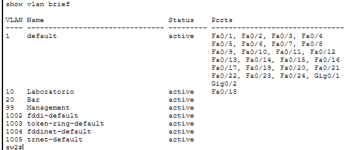
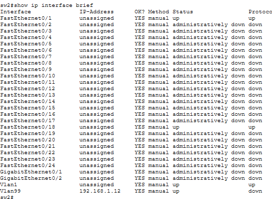
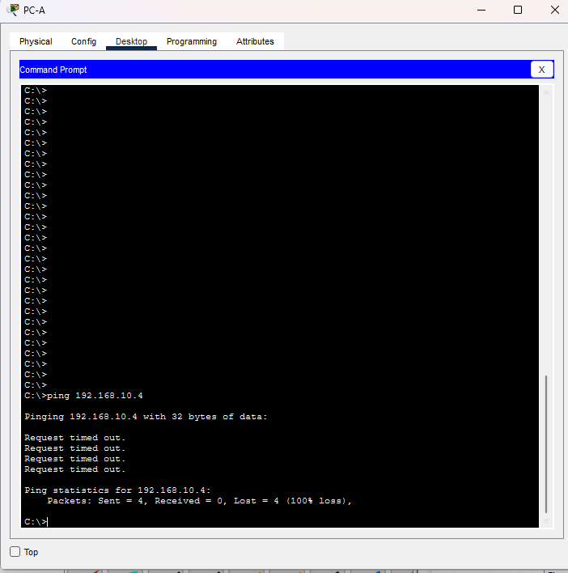
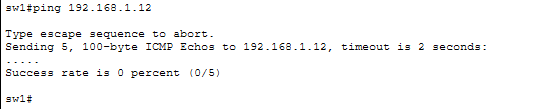

# Ejercicio 2 Resuelto — Topología VLAN en Packet Tracer

> Topología: SW-1 y SW-2 interconectados, cada uno con su PC (PC-A en SW-1, PC-B en SW-2).
>
> | Device | Interface | IP Address    | Subnet Mask   | Default Gateway |
> |--------|-----------|---------------|---------------|------------------|
> | SW-1   | VLAN 1    | 192.168.1.11  | 255.255.255.0 | N/A              |
> | SW-2   | VLAN 1    | 192.168.1.12  | 255.255.255.0 | N/A              |
> | PC-A   | NIC       | 192.168.10.3  | 255.255.255.0 | 192.168.10.1     |
> | PC-B   | NIC       | 192.168.10.4  | 255.255.255.0 | 192.168.10.1     |



## Inciso a

> a) Desde cada computadora, ingresar a la terminal y configurar los switch. Nombrar a los mismos sw1 y sw2 respectivamente.

Para realizar esta configuración, ingresamos a la terminal desde cada PC (conectadas por consola a los switches) y ejecutamos los siguientes comandos para cambiar el nombre de los dispositivos a `SW-1` y `SW-2`.

**Para SW-1 (desde PC-A):**
```text
Switch> enable
Switch# configure terminal
Switch(config)# hostname SW-1
SW-1(config)#
```

**Para SW-2 (desde PC-B):**
```text
Switch> enable
Switch# configure terminal
Switch(config)# hostname SW-2
SW-2(config)#
```

## Inciso b

> b) Asignar contraseñas privilegiadas, de consola y vty.

Asignamos las contraseñas requeridas para proteger el acceso privilegiado, el acceso por consola y el acceso remoto (VTY). Este procedimiento se repite en ambos switches.

**Configuración en SW-1 y SW-2:**
```text
SW-1(config)# enable secret class
SW-1(config)# line console 0
SW-1(config-line)# password cisco
SW-1(config-line)# login
SW-1(config-line)# exit
SW-1(config)# line vty 0 15
SW-1(config-line)# password cisco
SW-1(config-line)# login
SW-1(config-line)# exit
```

## Inciso c

> c) Encriptar las contraseñas (Ayuda: utilizar `service password-encryption`).

Para asegurar que las contraseñas configuradas en el inciso anterior no se muestren en texto plano al visualizar la configuración del equipo (por ejemplo, con `show running-config`), activamos el servicio de encriptación en ambos switches:

**Configuración en SW-1 y SW-2:**
```text
SW-1(config)# service password-encryption
```

## Inciso d

> d) Configurar las redes VLAN para ambos switch según la tabla de direcciones provista.

Asignamos las direcciones IP correspondientes a la interfaz virtual de la VLAN 1 en cada switch, para permitir su administración dentro de la red. Luego levantamos la interfaz con el comando `no shutdown`.

**Para SW-1:**
```text
SW-1(config)# interface vlan 1
SW-1(config-if)# ip address 192.168.1.11 255.255.255.0
SW-1(config-if)# no shutdown
SW-1(config-if)# exit
```

**Para SW-2:**
```text
SW-2(config)# interface vlan 1
SW-2(config-if)# ip address 192.168.1.12 255.255.255.0
SW-2(config-if)# no shutdown
SW-2(config-if)# exit
```

## Inciso e

> e) Desconectar todas las interfaces que no estén siendo utilizadas (Ayuda: podés ver las interfaces utilizando `show ip interface brief`).

Para mantener la seguridad en la red, ingresamos a las interfaces que no están en uso y las apagamos administrativamente. Usamos el comando `interface range` para seleccionar múltiples puertos a la vez.

**Configuración en los switches (suponiendo puertos del f0/2 al f0/5 y f0/7 al f0/24 sin uso, a modo de ejemplo):**
```text
SW-1(config)# interface range f0/2-5, f0/7-24, g0/1-2
SW-1(config-if-range)# shutdown
SW-1(config-if-range)# exit
```
*(Se realiza un procedimiento análogo en SW-2, dependiendo de en qué puerto esté conectada la PC y el otro switch).*

## Inciso f

> f) Guardar la configuración (`write memory`).

Guardamos la configuración en la NVRAM para que los cambios persistan ante un posible reinicio de los equipos:
```text
SW-1# write memory
Building configuration...
[OK]
```
*(Lo mismo para SW-2).*

## Inciso g

> g) Testear comunicación usando pings entre las computadoras.

En esta etapa inicial, como ambas computadoras (PC-A y PC-B) están configuradas en la misma subred (`192.168.10.0/24`) y los puertos de los switches todavía pertenecen a la VLAN 1 (por defecto), la comunicación es directa y el ping es exitoso.



Como se puede apreciar en la captura de la consola de PC-A, se enviaron 4 paquetes y se recibieron los 4 sin pérdida.

## Inciso h

> h) Crear VLANs en ambos switches (Laboratorio, Bar, Management).

Procedemos a crear las VLANs solicitadas (10, 20 y 99) asignándoles sus respectivos nombres. Este paso se realiza en la configuración global de ambos switches:

**Configuración en SW-1 y SW-2:**
```text
SW-1(config)# vlan 10
SW-1(config-vlan)# name Laboratorio
SW-1(config-vlan)# vlan 20
SW-1(config-vlan)# name Bar
SW-1(config-vlan)# vlan 99
SW-1(config-vlan)# name Management
SW-1(config-vlan)# exit
```

## Inciso i

> i) Utilizar `show vlan brief` para visualizar la lista de VLANs en alguno de los switch. ¿Cuál es la VLAN utilizada por defecto?. Colocar el output en el informe.

Ejecutamos el comando `show vlan brief` para verificar que las VLANs se hayan creado correctamente.



Como se observa en la imagen, **la VLAN utilizada por defecto es la VLAN 1**. En ella se encuentran asignados todos los puertos del switch inicialmente, hasta que los movamos a otras VLANs. También podemos ver las VLANs 10, 20 y 99 que acabamos de crear en estado activo.

## Inciso j

> j) Asignar la PC-A a la VLAN Laboratorio.

Configuramos el puerto al cual está conectada la PC-A (`f0/6` en SW-1) como puerto de acceso y lo asignamos a la VLAN 10 (Laboratorio).

**Configuración en SW-1:**
```text
SW-1(config)# interface f0/6
SW-1(config-if)# switchport mode access
SW-1(config-if)# switchport access vlan 10
SW-1(config-if)# exit
```

## Inciso k

> k) Desde la VLAN 1, remover la ip de Management y configurarla para funcionar en la VLAN 99 (que configuramos como Management).

Quitamos la dirección IP de administración de la VLAN 1 y se la asignamos a la interfaz virtual de la VLAN 99, que es nuestra VLAN dedicada para Management.

**Configuración en SW-1:**
```text
SW-1(config)# interface vlan 1
SW-1(config-if)# no ip address
SW-1(config-if)# interface vlan 99
SW-1(config-if)# ip address 192.168.1.11 255.255.255.0
SW-1(config-if)# end
```

## Inciso l

> l) Verificar el estado de la VLAN utilizando `show vlan brief` y el estado de las interfaces utilizando `show ip interface brief`. Colocar los output en el informe e interpretar.

A continuación, verificamos el estado general del switch (mostrado desde SW-2) luego de realizar las configuraciones de los incisos posteriores:

**Estado de las VLANs:**


*Interpretación:* Aquí se observa que el puerto `Fa0/18` (donde está conectada la PC-B) ya fue removido de la VLAN 1 y se encuentra correctamente asignado a la VLAN 10 (Laboratorio).

**Estado de las interfaces:**


*Interpretación:* Podemos corroborar que los puertos no utilizados se encuentran apagados (`administratively down`) como se configuró en el inciso E. Además, notamos que la interfaz virtual `Vlan1` ya no posee IP, mientras que la interfaz `Vlan99` tiene asignada la dirección IP `192.168.1.12` correspondiente a la administración.

## Inciso m

> m) Asignar la PC-B a la VLAN Laboratorio en el sw2. Repetir el inciso k) pero para el sw2.

Aplicamos la configuración en SW-2 para ubicar la computadora en la VLAN correspondiente y asegurar el acceso de administración en la VLAN 99:

**Configuración en SW-2:**
```text
SW-2(config)# interface f0/18
SW-2(config-if)# switchport mode access
SW-2(config-if)# switchport access vlan 10
SW-2(config-if)# exit

SW-2(config)# interface vlan 1
SW-2(config-if)# no ip address
SW-2(config-if)# interface vlan 99
SW-2(config-if)# ip address 192.168.1.12 255.255.255.0
SW-2(config-if)# exit
```

## Inciso n

> n) Verificar la conectividad entre PC-A y PC-B utilizando pings. Verificar conectividad entre sw1 y sw2 utilizando pings. Interpretar los resultados.

Tras configurar las VLANs, repetimos la prueba de comunicación.

**Ping entre PC-A y PC-B:**


**Ping entre SW-1 y SW-2:**


**Interpretación de los resultados:**
Como se puede observar en las capturas, ambos pings ahora **fallan** ("Request timed out" y "Success rate is 0 percent"). 

Esto se debe a la segmentación lógica impuesta por las VLANs. Actualmente:
1. Las PCs están en la **VLAN 10**.
2. Las IPs de administración de los switches están en la **VLAN 99**.

Sin embargo, el cable que interconecta a los switches `SW-1` y `SW-2` sigue configurado como un puerto de acceso en la **VLAN 1** (por defecto). Como no hemos configurado ese enlace como un puerto **Trunk** (troncal), el mismo no permite el paso del tráfico etiquetado perteneciente a la VLAN 10 ni a la VLAN 99. En consecuencia, el tráfico queda aislado localmente en cada switch y no llega al otro extremo.
