# Trabajo Práctico N°4 — Ejercicio 3
### Redes LAN a bordo de una aeronave — VLANs, NAT y ACLs

**Grupo:** AURACAST

---

## 1. Objetivo

Simular el despliegue de una red LAN a bordo de un avión, segmentada en tres clases de acceso mediante VLANs:

| Segmento | VLAN | Acceso definido |
|---|---|---|
| Turista | 10 | Solo al servidor de entretenimiento |
| Business | 20 | Servidor de entretenimiento + Internet |
| Administración | 99 | Acceso total a la red |

---

## 2. Diagrama de topología

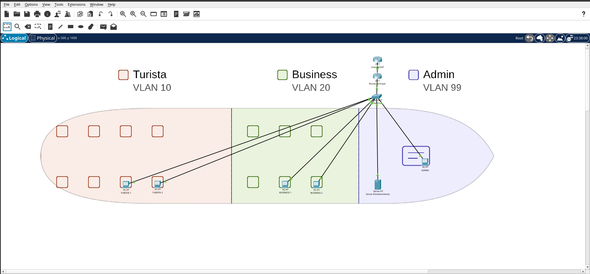

La red está compuesta por:
- Un **Switch 2960-24TT** con VLANs 10 (Turista), 20 (Business) y 99 (Admin), y un enlace trunk hacia el router.
- Un **Router Principal (2911)** que realiza el ruteo entre VLANs (router-on-a-stick), NAT overload y filtrado con ACLs.
- Un **Router Internet/ISP (2911)** que simula la salida a internet.
- Un **Server de Entretenimiento**, alojado en la VLAN de Administración, con servicio HTTP.
- Dos PCs por segmento Turista y Business, y una PC de Administración.

---

## 3. Tabla de direccionamiento

| VLAN | Nombre | Red IP | Gateway | Acceso |
|---|---|---|---|---|
| 10 | Turista | 10.10.10.0/24 | 10.10.10.1 | Solo servidor |
| 20 | Business | 10.10.20.0/24 | 10.10.20.1 | Servidor + Internet |
| 99 | Administración | 10.10.99.0/24 | 10.10.99.1 | Acceso total |
| — | Enlace ISP | 200.0.0.0/30 | 200.0.0.1–.2 | — |

**IPs efectivamente asignadas por DHCP (verificadas con `ipconfig`):**

| Dispositivo | IP | Máscara | Gateway |
|---|---|---|---|
| Turista 1 | 10.10.10.12 | 255.255.255.0 | 10.10.10.1 |
| Turista 2 | 10.10.10.11 | 255.255.255.0 | 10.10.10.1 |
| Business 1 | 10.10.20.11 | 255.255.255.0 | 10.10.20.1 |
| Business 2 | 10.10.20.12 | 255.255.255.0 | 10.10.20.1 |
| Admin | 10.10.99.11 | 255.255.255.0 | 10.10.99.1 |
| Server Entretenimiento | 10.10.99.10 (estática) | 255.255.255.0 | 10.10.99.1 |

---

## 4. Configuración del Switch

### 4.1 Running-config

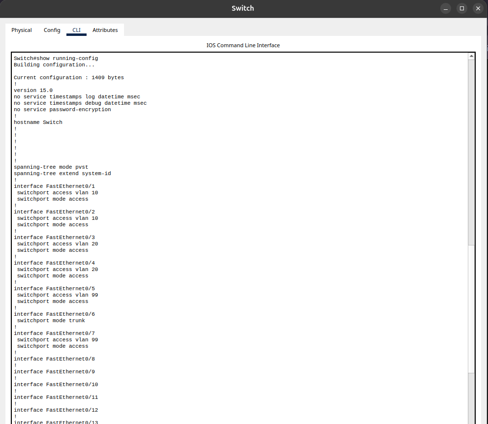

Puertos asignados por VLAN:

| VLAN | Puertos | Descripción |
|---|---|---|
| 10 (Turista) | Fa0/1, Fa0/2 | Turista 1 y 2 |
| 20 (Business) | Fa0/3, Fa0/4 | Business 1 y 2 |
| 99 (Admin) | Fa0/5, Fa0/7 | PC Admin y Server |
| Trunk | Fa0/6 | Enlace hacia el Router Principal |

### 4.2 Verificación — `show vlan brief`, `show interfaces trunk`, `show interfaces status`

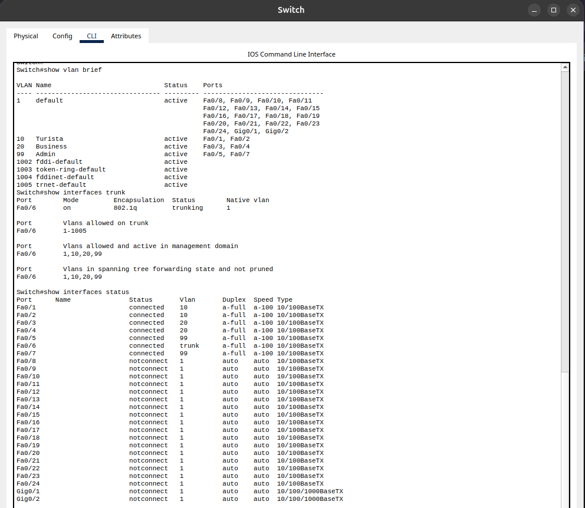

**Interpretación:**
- Las tres VLANs (10, 20 y 99) están activas y con los puertos correctos.
- El puerto Fa0/6 está correctamente configurado como **trunk** (802.1Q), transportando las VLANs 1, 10, 20 y 99.
- Todos los puertos en uso figuran como `connected`, confirmando que el cableado y la asignación de VLAN son correctos.

---

## 5. Configuración del Router Principal

### 5.1 Running-config — interfaces, NAT, ACL, ruta

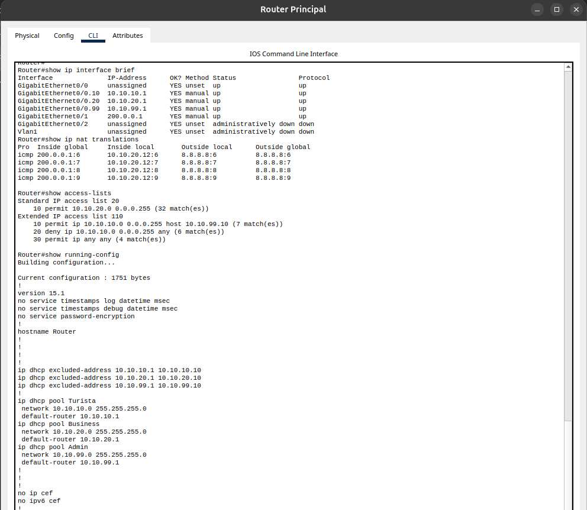
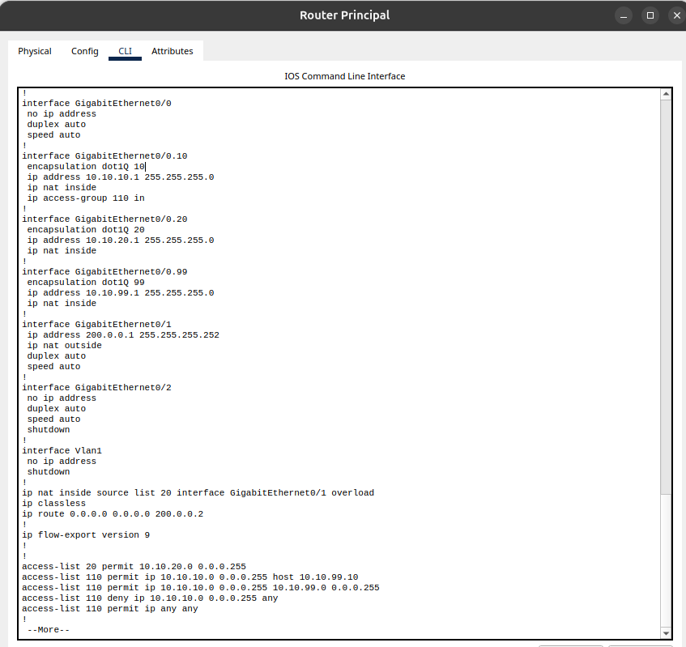

**Interpretación:**
- Todas las subinterfaces (`Gig0/0.10`, `Gig0/0.20`, `Gig0/0.99`) y el enlace hacia el ISP (`Gig0/1`) están en estado `up/up`.
- La tabla de traducciones NAT muestra traducciones activas de tipo `icmp` desde direcciones internas de la VLAN Business (`10.10.20.12`) hacia `8.8.8.8`, confirmando que el NAT overload funciona correctamente para ese segmento.
- Los contadores de `show access-lists` muestran matches tanto en la regla de `permit` (tráfico Turista → Servidor) como en `deny` (tráfico Turista bloqueado hacia otros destinos), evidenciando que la ACL está siendo evaluada activamente.

### 5.2 Nota sobre el diseño de la ACL de Turista

La guía del TP sugería una ACL numerada (100) aplicada en dirección `out` sobre la subinterfaz de Turista, sin excepción para el servidor. Tal como estaba planteada, esa regla no permitía lograr el resultado esperado (acceso al servidor sí, a internet no) sin bloquear también el tráfico legítimo hacia el servidor de entretenimiento.

Por eso se optó por una ACL extendida propia (**access-list 110**), aplicada con `ip access-group 110 in` sobre la subinterfaz `Gig0/0.10`, que permite explícitamente el tráfico de Turista hacia el servidor (`host 10.10.99.10`) antes de denegar el resto — logrando así el aislamiento deseado sin afectar el acceso al servicio de entretenimiento.

---

## 6. Servidor de Entretenimiento

### 6.1 Configuración de red (IP estática)

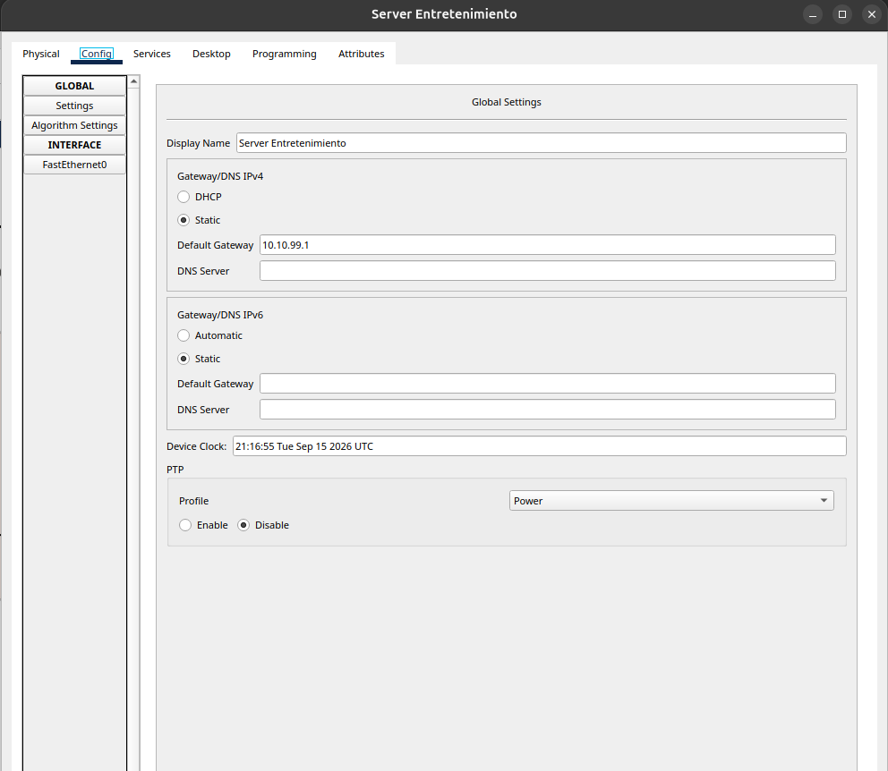

El servidor se configuró con **IP estática** `10.10.99.10 / 255.255.255.0`, gateway `10.10.99.1`. Es importante que un servidor tenga IP fija (no DHCP), ya que los clientes dependen de conocer de antemano su dirección.

### 6.2 Servicio HTTP

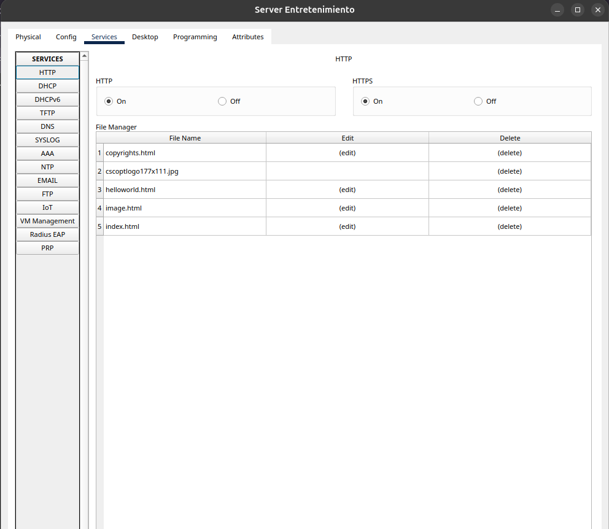

El servicio **HTTP** está activo (`On`), sirviendo un archivo `index.html` personalizado con el siguiente contenido:

```html
<html>
<head><title>AirConnect Entertainment</title></head>
<body style="text-align:center; font-family:Arial;">
  <h1>AirConnect Entertainment</h1>
  <p>Bienvenido a bordo. Disfrute nuestras películas y música.</p>
  <hr>
  <h2>GRUPO AURACAST</h2>
  <h3>Ejercicio 3 - TP4</h3>
</body>
</html>
```

---

## 7. Pruebas realizadas

### 7.1 Turista → Servidor de entretenimiento (ping)

Turista 1:
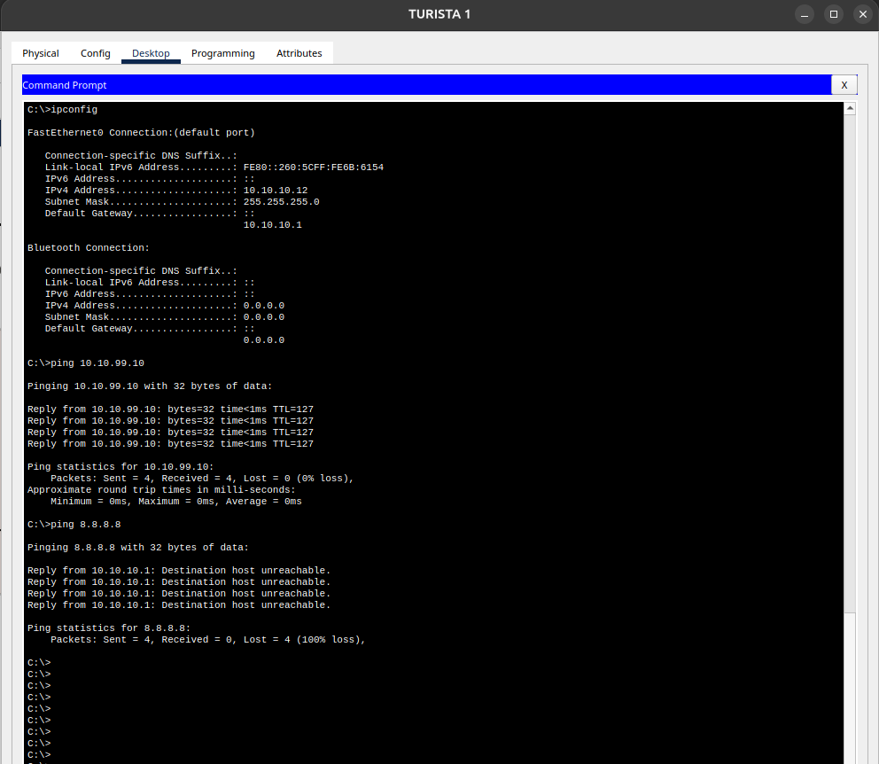

Turista 2:


**Resultado:** ✅ El ping a `10.10.99.10` responde correctamente (0% loss) desde ambas PCs Turista. El ping a `8.8.8.8` es bloqueado (`Destination host unreachable`), confirmando que la ACL 110 impide la salida a internet desde este segmento.

### 7.2 Turista → Servidor (HTTP)

Turista 1:


Turista 2:
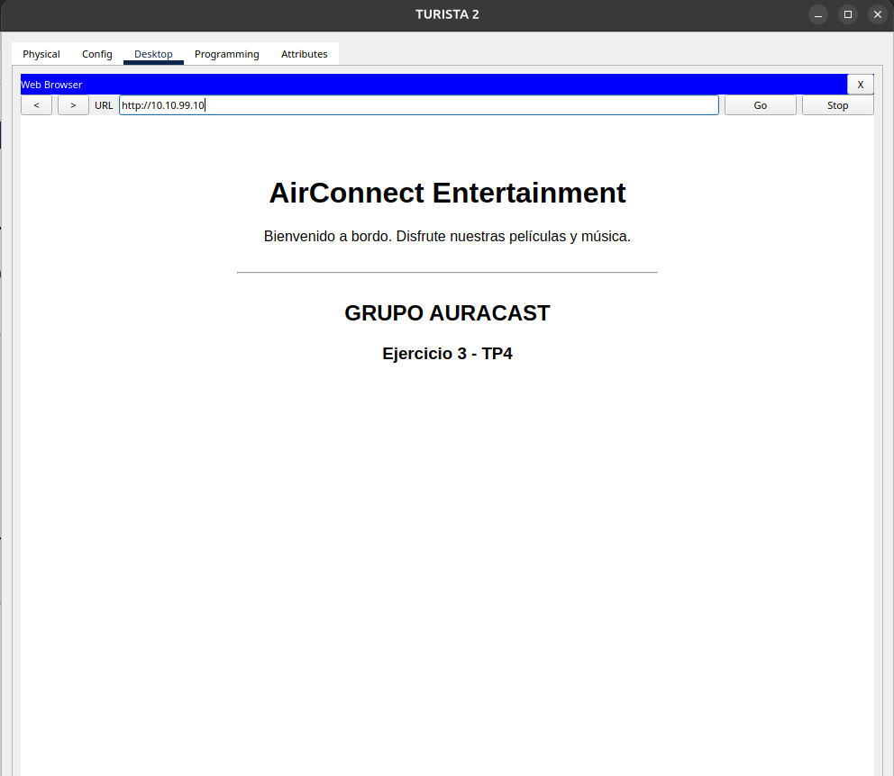

**Resultado:** ✅ La página del servidor de entretenimiento carga correctamente desde ambas PCs Turista.

### 7.3 Business → Servidor e Internet

Business 1 — ping a servidor e internet:
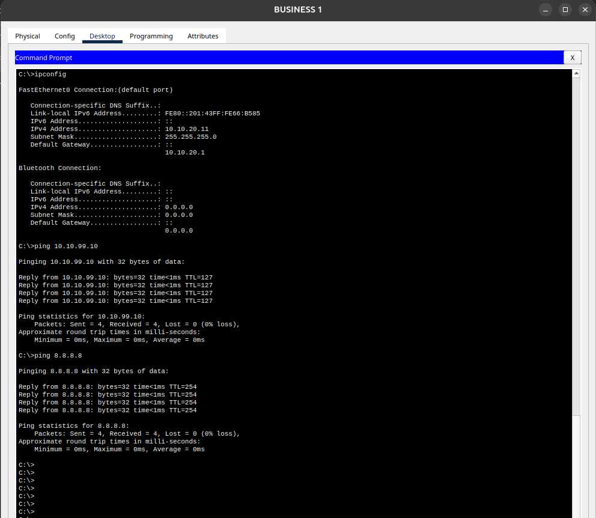

Business 2 — ping a servidor e internet:


**Resultado:** ✅ Ambas PCs Business responden correctamente tanto al servidor (`10.10.99.10`) como a internet (`8.8.8.8`), con 0% de pérdida de paquetes.

### 7.4 Business → Servidor (HTTP)

Business 1:
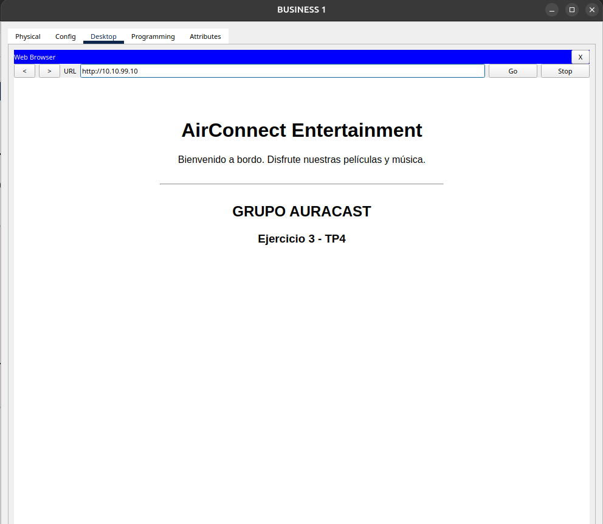

Business 2:
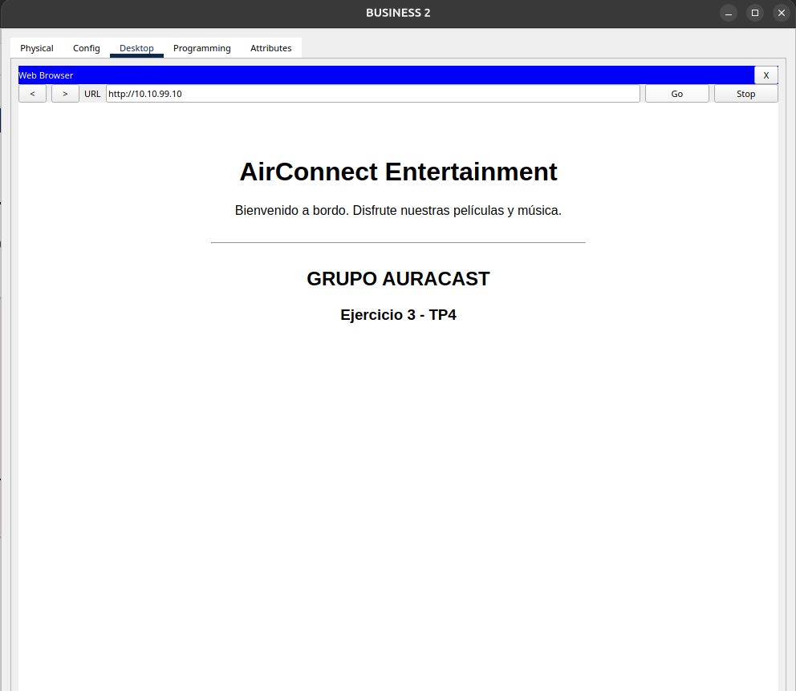

**Resultado:** ✅ La página del servidor carga correctamente desde ambas PCs Business.

### 7.5 Administración → todos los segmentos

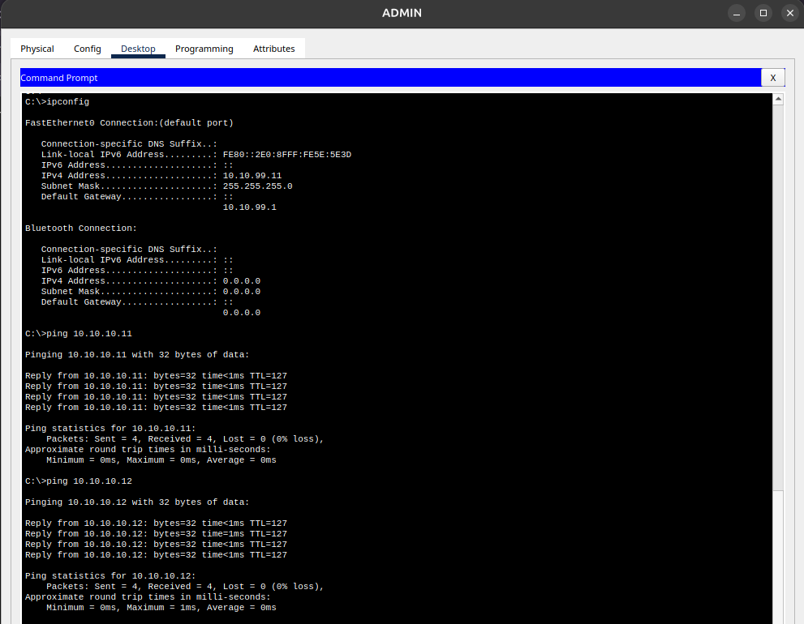
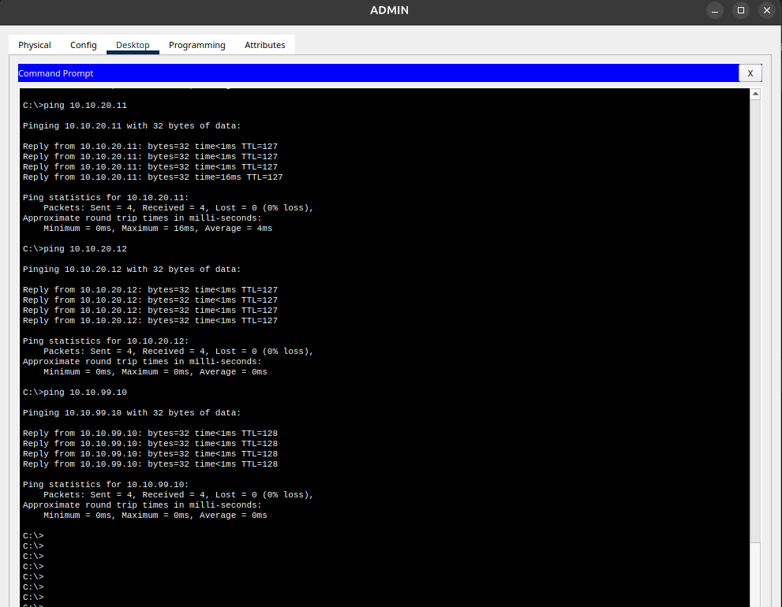

**Resultado:** ✅ Desde la PC de Administración se verificó conectividad exitosa hacia:
- Turista 1 y 2 (`10.10.10.11`, `10.10.10.12`)
- Business 1 y 2 (`10.10.20.11`, `10.10.20.12`)
- Servidor de entretenimiento (`10.10.99.10`)

Confirmando el acceso total definido para este segmento.

### 7.6 Tabla resumen de resultados

| Prueba | Desde | Hacia | Resultado esperado | Resultado obtenido |
|---|---|---|---|---|
| Ping al servidor | PC Turista | 10.10.99.10 | ✅ Responde | ✅ Responde (0% loss) |
| HTTP al servidor | PC Turista | http://10.10.99.10 | ✅ Carga | ✅ Carga |
| Ping a Internet | PC Turista | 8.8.8.8 | ❌ Bloqueado | ❌ Bloqueado (host unreachable) |
| HTTP al servidor | PC Business | http://10.10.99.10 | ✅ Carga | ✅ Carga |
| Ping a Internet | PC Business | 8.8.8.8 | ✅ Funciona | ✅ Funciona (0% loss) |
| Ping entre Admin y todos | Admin PC | Turista / Business / Servidor | ✅ Todos | ✅ Todos responden |


