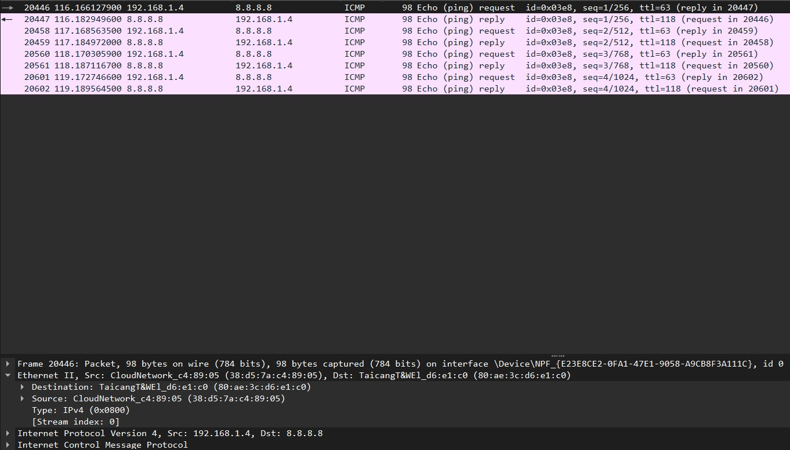
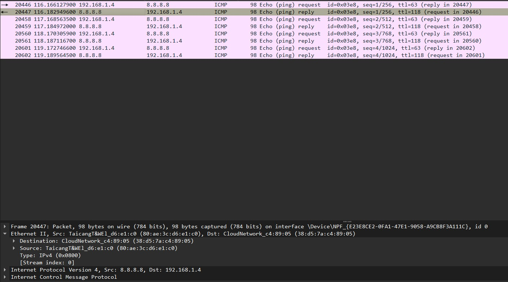
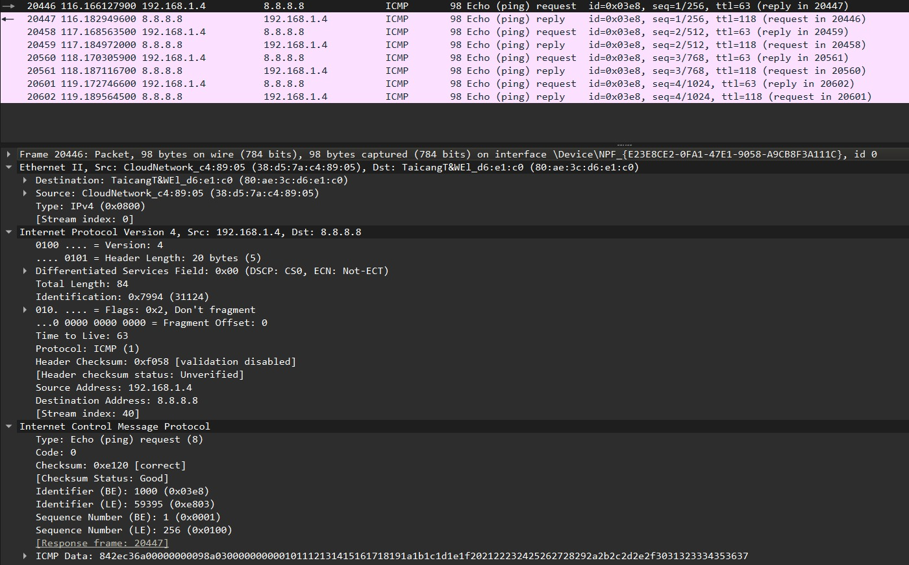
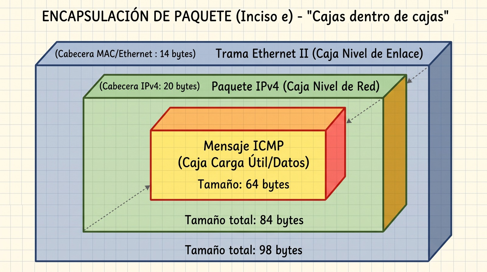

# ICMP y primer contacto con Wireshark (Primera Parte):

#### a) ¿Qué es ICMP y para qué se usa? ¿Transporta datos de aplicaciones como lo hacen TCP o UDP?

ICMP significa Internet Control Message Protocol (o Protocolo de Mensajes de Control de Internet) y se usa en la capa de red para poder enviar mensajes de errores, de diagnóstico o de información sobre en qué estado están las comunicaciones. Y a diferencia de los protocolos TCP y UDP, el ICMP no esta diseñado para transportar datos de aplicaciones de usuario, sino que es una herramienta de soporte solo para la infraestructura de la red.

#### b) ¿Qué relación tiene con IP? ¿Viaja dentro de IP, al lado de IP o debajo de IP? ¿Cómo sabe el receptor que el contenido de un paquete IP es ICMP?

El ICMP viaja adentro de un paquete IP. La carga que es útil del paquete del protocolo de internet versión 4 (o IPv4) directamente encapsula el mensaje ICMP. El receptor sabe el contenido del paquete gracias a que lee el campo "Protocolo" del encabezado IP, el cual tiene el contenido numérico específico que indica la presencia del ICMP.

#### c) ¿Qué hace ping? ¿Qué son un Echo Request y un Echo Reply? ¿Qué campos de ICMP permiten distinguirlos?

El ping es una herramienta que verifica la conectividad a nivel de red con otro equipo, enviando paquetes de prueba y midiendo el tiempo de respuesta.
El Echo Request es la solicitud de eco inicial que se envía al destino para comprobar si está activo, mientras que el Echo Reply hace lo mismo, solo que es la respuesta del eco que el equipo de destino que devuelve al emisor original confirmando la recepción.
Los campos que permiten distinguirlos son el campo de tipo mensaje de ICMP (icmp.type): un Echo Request utiliza el valor 8, mientras que un Echo Reply usa el valor 0.

#### d) ¿Qué información mínima contiene un mensaje ICMP de tipo Echo?

El encabezado tiene el tipo de mensaje, un código y una suma de comprobación (el checksum) para detectar errores en la transmisión. También tiene un identificador, un número de secuencia para que el emisor original pueda emparejar cada solicitud con su respuesta correspondiente y una sección de datos que va con el mensaje de ida y también en el de vuelta reflejado idénticamente.

# Segunda Parte

### Tabla de Capas (Análisis de Echo Request)

| Capa (como la nombra Wireshark) | Dirección/identificador origen | Dirección/identificador destino | ¿Qué campo indica qué protocolo viene "adentro"? |
|---------------------------------|--------------------------------|---------------------------------|--------------------------------------------------|
| Ethernet II | MAC de la PC | MAC del Router/Gateway (`80:ae:3c:d6:e1:c0`) | Campo **Type** (`IPv4`, `0x0800`) |
| Internet Protocol Version 4 | IP local (`192.168.1.4`) | IP de Internet (`8.8.8.8`) | Campo **Protocol** (`ICMP`, `1`) |
| Internet Control Message Protocol | Identifier (ID) | Identifier (ID) | *No aplica (lleva el Data/Payload)* |
| Datos / payload | - | - | - |

*(Nota: El protocolo ICMP no utiliza direcciones de origen y destino convencionales. En su lugar, usa el campo **Identifier** y el **Sequence Number** para poder identificar y vincular cada Request con su respectivo Reply).*

#### a) La MAC destino del Echo Request enviado a 8.8.8.8, ¿es la MAC de 8.8.8.8? ¿De que equipo es? Comparenla con la MAC destino del ping al gateway. ¿Que conclusion sacan sobre el alcance de una direccion MAC frente al de una direccion IP?

Al observar la captura del paquete **Echo (ping) request** dirigido a la IP de Internet (`8.8.8.8`), podemos ver en la capa **Ethernet II** que la dirección MAC de destino es `80:ae:3c:d6:e1:c0` (fabricante _TaicangT&WEl_).

**No, no es la MAC de 8.8.8.8.** Esta dirección MAC le pertenece al **Gateway (el router local)** de la red. Aunque el ping original (captura del terminal) haya arrojado pérdida de paquetes hacia el gateway, la MAC de destino a la que se envían los paquetes para salir a Internet siempre será la del router de casa.

**Conclusión:**
Esta diferencia nos permite entender claramente el propósito de cada tipo de dirección:

1. **Alcance de la Dirección MAC (Física / Capa de Enlace):** Su alcance es estrictamente **local**. Sirve únicamente para enviar la trama desde la computadora hasta el próximo salto inmediato en la misma subred (en este caso, el router).
2. **Alcance de la Dirección IP (Lógica / Capa de Red):** Tiene un alcance **extremo a extremo** (end-to-end). La IP de destino se mantiene intacta como `8.8.8.8` a lo largo de toda Internet para asegurar que los datos lleguen al destinatario final, mientras que las direcciones MAC irán cambiando en cada cable o salto entre routers por los que pase el paquete.

#### b) Comparar un Echo Request con su Echo Reply, listar qué campos cambian y cuáles se mantienen en las cabeceras Ethernet, IPv4 e ICMP, y justificar el porqué (especialmente por qué el ID y número de secuencia se mantienen para poder vincular la respuesta).

Al comparar el **Echo Request** con su respectivo **Echo Reply**, observamos los siguientes cambios y similitudes en las cabeceras:

- **Ethernet II:** Las direcciones MAC de origen y destino se **invierten**. En el Request, el origen es la PC y el destino es el router. En el Reply, el origen es el router y el destino es la PC.
- **IPv4:** Las direcciones IP de origen y destino también se **invierten**. El Request va de la IP local (`192.168.1.4`) hacia `8.8.8.8`, y el Reply viene de `8.8.8.8` hacia `192.168.1.4`. Otros campos como el _TTL_ o el _Checksum_ también cambian.
- **ICMP:**
  - El campo **Type** cambia de `8` (Echo Request) a `0` (Echo Reply), indicando la naturaleza del mensaje.
  - El **Identifier** (ID) y el **Sequence Number** se **mantienen idénticos** en ambos paquetes. Esto es crucial porque permite que la computadora emisora sepa exactamente a qué pregunta específica corresponde la respuesta que está recibiendo (los vincula).

#### c) Encontrar el "payload" (datos) del ping, ver su tamaño, contenido, si es igual en la respuesta, y razonar por qué sería distinto entre un ping hecho desde Windows y uno desde Linux.

Si revisamos la capa **ICMP** (como se ve en la captura), al final encontramos el campo de **Data** (Payload).

- El tamaño del payload es de **48 bytes** (como se observa al restarle las cabeceras a la longitud total del paquete de 98 bytes capturado en el cable).
- El contenido está compuesto por datos en hexadecimal (marcas de tiempo y otra información generada por el SO).
- El payload en el Echo Reply es **exactamente el mismo** que en el Echo Request (ya que debe hacer un "eco" exacto de lo enviado).

Si comparáramos un ping hecho desde Windows con uno de Linux, veríamos que **el tamaño y contenido son distintos**. Windows por defecto envía 32 bytes de payload consistentes en las letras del abecedario (abcd...), mientras que Linux envía 48 bytes que suelen incluir timestamps (marcas de tiempo) para que el comando `ping` pueda calcular la latencia con mayor precisión al recibir la respuesta.

#### d) ¿Qué valor de TTL tiene el Echo Request que ustedes enviaron? ¿Y el Reply que llegó de 8.8.8.8? ¿Por qué no son iguales? (Pista: investiguen qué hace un router con el TTL.)

En la captura, el **Echo Request** tiene un valor de **TTL = 63**, mientras que el **Echo Reply** que llegó desde `8.8.8.8` tiene un valor de **TTL = 118**.

No son iguales debido a la función fundamental que cumple el TTL (Time to Live) en las redes IP:
Cada vez que un paquete pasa a través de un router (lo que se conoce como un "salto"), ese router le resta 1 al valor del TTL antes de reenviarlo al siguiente destino. Si el TTL llega a 0, el paquete se descarta (esto evita que los paquetes se queden dando vueltas infinitamente en la red si hay bucles de enrutamiento).

- **El Echo Request (TTL 63):** Al ejecutar el comando ping desde una máquina virtual Linux, el sistema operativo generó el paquete con su TTL inicial por defecto (que en Linux es 64). Como la captura de Wireshark se hizo desde Windows (el sistema anfitrión), el paquete tuvo que pasar por el "router" interno (NAT) que conecta la máquina virtual con Windows, el cual le restó 1. Por eso, al ser capturado en Windows, ya figura con TTL 63.
- **El Echo Reply (TTL 118):** El servidor de Google (`8.8.8.8`) respondió usando otro sistema operativo cuyo TTL inicial es distinto (suponiendo que es 128 o tal vez 255). Durante el largo viaje de vuelta desde los servidores de Google hasta nuestra computadora, el paquete atravesó varios routers a través de Internet, y cada uno le descontó 1 a su TTL. Al llegar a nuestra computadora con un valor de 118, esto indica que el paquete de respuesta dio varios saltos en la red hasta alcanzarnos.

#### e) Dibujen la encapsulación del paquete que eligieron como "cajas dentro de cajas", indicando para cada caja qué tamaño en bytes tiene según Wireshark.

La encapsulación del paquete capturado se compone de la siguiente manera, tal cual ilustra el esquema:

- **Caja externa (Capa de Enlace):** Trama Ethernet II -> Tamaño: **14 bytes** de cabecera.
- **Caja intermedia (Capa de Red):** Paquete IPv4 -> Tamaño: **20 bytes** de cabecera.
- **Caja interna (Capa de Red / Soporte):** Mensaje ICMP (Carga útil/Datos) -> Tamaño: **64 bytes** en total.

_(Sumando los tamaños obtenemos: 14 + 20 + 64 = 98 bytes en total que reporta Wireshark para toda la trama)._
