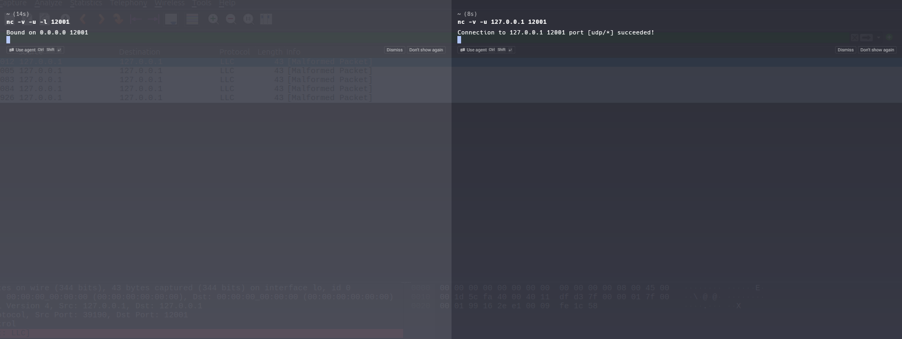
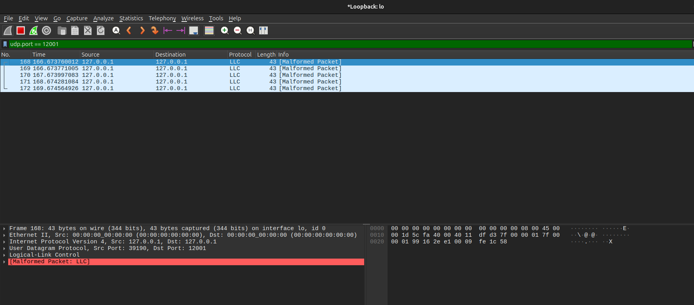
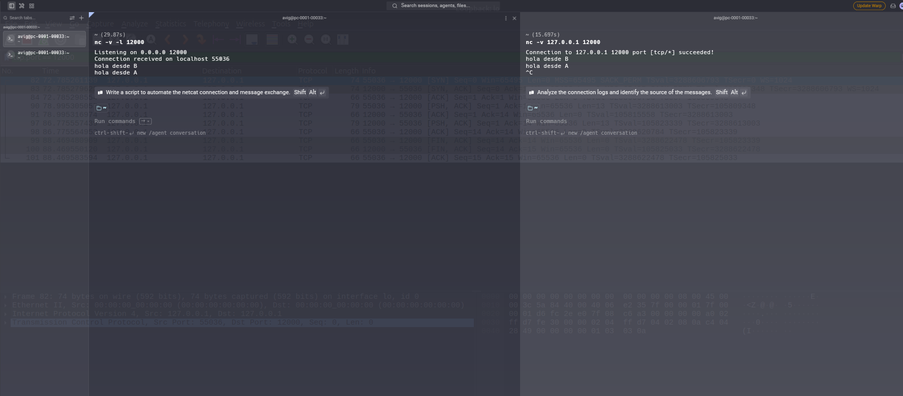
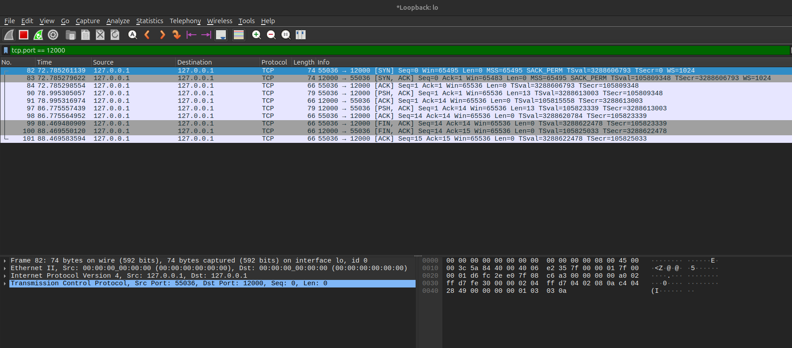
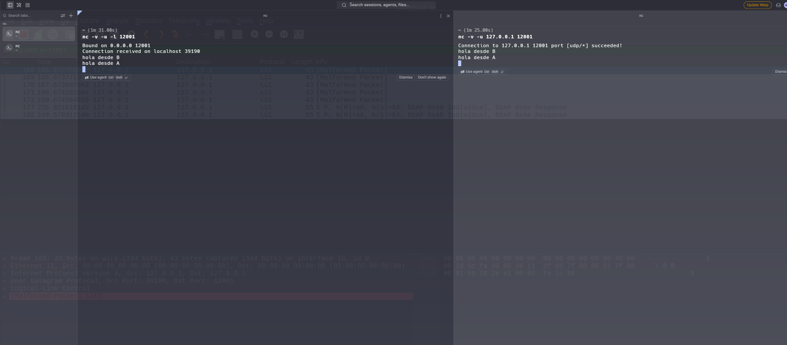
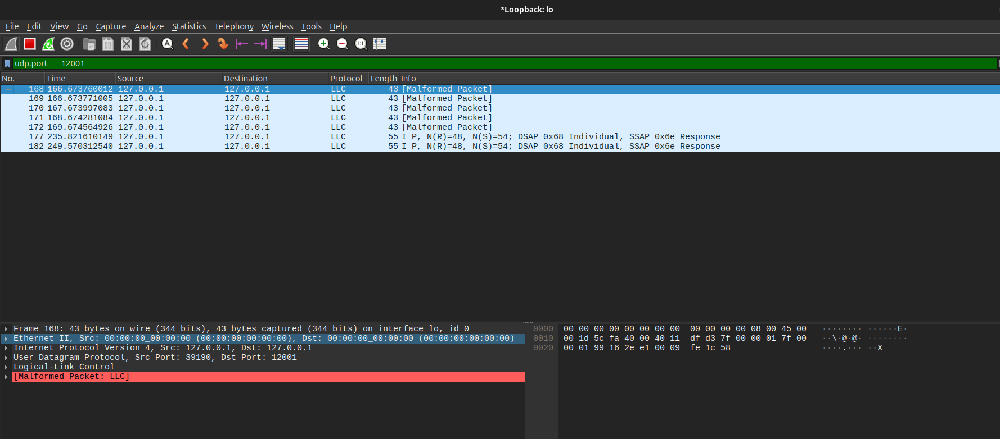
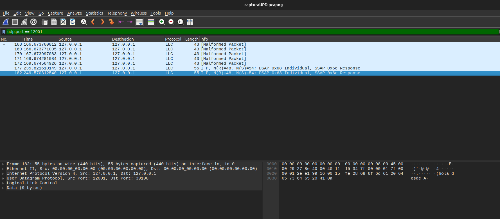
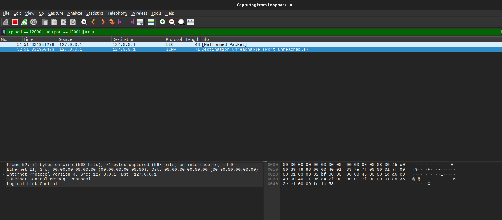
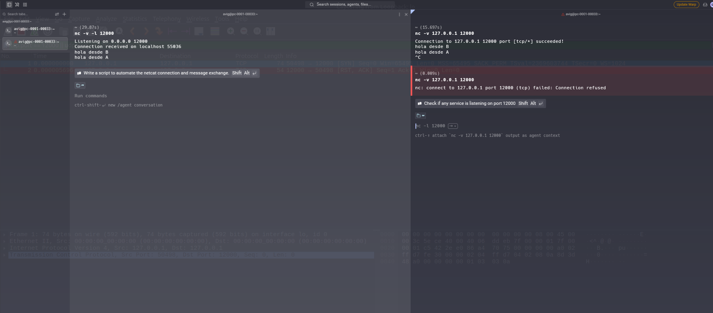
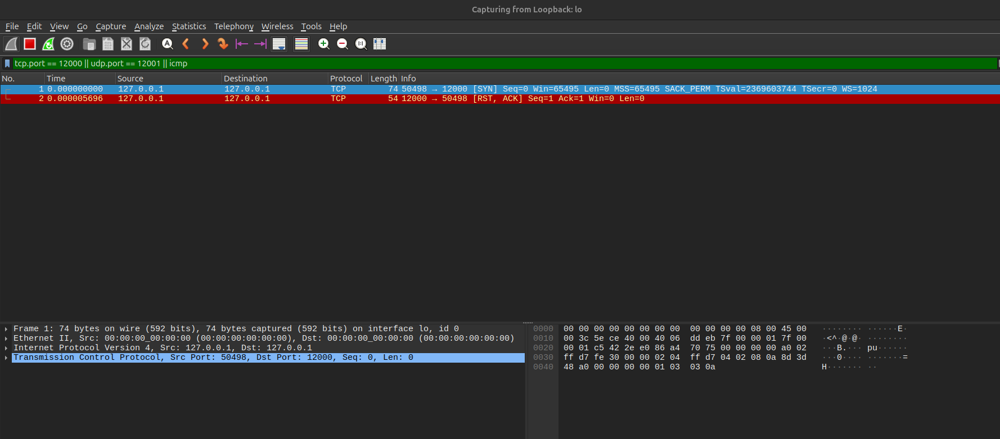

# TP N°5 – Punto 3: Experimento UDP con nc en loopback

## Condiciones del experimento

Realizamos el experimento en una computadora con Linux, capturando en la interfaz de loopback (`lo`) con Wireshark y aplicando el display filter `udp.port == 12001`. Usamos `nc` (paquete `netcat-openbsd`) en dos terminales: en la terminal A levantamos el servidor con `nc -v -u -l 12001` y en la B el cliente con `nc -v -u 127.0.0.1 12001`.

Una vez conectado el cliente, enviamos un mensaje en cada sentido (`hola desde B` y `hola desde A`) y cerramos con Ctrl+C. Para comparar, repetimos el experimento con TCP en el puerto 12000: servidor con `nc -v -l 12000`, cliente con `nc -v 127.0.0.1 12000` y filtro `tcp.port == 12000`.

**Sobre el aviso "Malformed Packet: LLC".** En todas las tramas Wireshark mostró este aviso. Al analizar los paquetes 177 y 182 concluimos que no es un error de la red sino de interpretación: Wireshark intenta decodificar el payload UDP como LLC y falla, porque en realidad es texto de la aplicación. Lo confirmamos porque los primeros 4 bytes del mensaje (`hola`) aparecen leídos como cabecera LLC (`DSAP 0x68` = `h`, `SSAP 0x6f` = `o`) y los 9 bytes restantes quedan como `Data`. El payload completo es de 13 bytes (`hola desde B\n`).

---

## a) ¿Qué pasó en la red al ejecutar el cliente, antes de escribir el primer mensaje? Comparación con TCP



En la imagen se ve que el servidor solo muestra `Bound on 0.0.0.0 12001` y el cliente `Connection to 127.0.0.1 12001 port [udp/*] succeeded!`. Todavía no habíamos escrito nada.



Aun así, Wireshark registró 5 datagramas (paquetes 168 a 172) de 43 bytes cada uno, separados por aproximadamente 1 segundo. Cada uno transporta un único byte de datos (`0x58`, la letra `X`): el campo Length de UDP vale 9, que son 8 bytes de cabecera más 1 de dato. Esa `X` no se muestra como texto en ninguna de las dos terminales.

Interpretamos que estos paquetes son una particularidad de `nc -v` (versión OpenBSD): para poder imprimir el mensaje de "succeeded", el programa envía por su cuenta datagramas de prueba. Con `ncat` o sin `-v` probablemente no habríamos visto tráfico. Además, ese "succeeded" no demuestra que haya alguien escuchando, porque UDP no confirma nada.

**Comparación con TCP:** en el experimento con TCP, apenas se ejecutó el cliente y antes de escribir nada, Wireshark mostró el three-way handshake: el `SYN` (paquete 82), el `SYN, ACK` (83) y el `ACK` (84), que establecen la conexión y sincronizan los números de secuencia.





En UDP no existe ese establecimiento: el `connect()` solo guarda localmente la IP y el puerto de destino, y los paquetes que vimos son datagramas sueltos a los que nadie responde.

## b) ¿Cuántos datagramas generó cada mensaje? ¿Hay algo parecido a un ACK?





Cada mensaje generó exactamente un datagrama. `hola desde B` fue el paquete 177, que va de B a A (puerto 39190 a 12001), y `hola desde A` fue el paquete 182, que va de A a B (puerto 12001 a 39190). Los dos miden 55 bytes.




No encontramos nada parecido a un ACK. Después del paquete 177 no aparece ningún paquete de confirmación, y el 182 no es una confirmación sino un mensaje de la aplicación con datos propios. Esto es coherente con el diseño de UDP: no confirma la recepción, no reordena y no retransmite, por lo que si un datagrama se pierde nadie se entera.

## c) Comparación entre el encabezado UDP y el TCP

En el hexadecimal del paquete 177 (imagen anterior) verificamos que la cabecera UDP comienza en el offset 34, después de 14 bytes de Ethernet y 20 de IP, y ocupa 8 bytes:

```
99 16 | 2e e1 | 00 15 | fe 28
  |       |       |       └─ Checksum (0xfe28)
  |       |       └───────── Length = 21 (8 de cabecera + 13 de datos)
  |       └───────────────── Puerto destino = 12001
  └───────────────────────── Puerto origen = 39190
```

El encabezado UDP tiene entonces solo cuatro campos de 2 bytes cada uno: puerto origen, puerto destino, longitud y checksum, para un total fijo de **8 bytes**.

El encabezado TCP, en cambio, tiene como mínimo **20 bytes** y puede llegar a 60 con opciones. Además de los puertos y el checksum, incluye el número de secuencia (4 bytes), el número de ACK (4 bytes), el data offset junto con las flags (`SYN`, `ACK`, `FIN`, `RST`, `PSH`…), el tamaño de ventana, el urgent pointer y las opciones (MSS, SACK, timestamps, window scale). En nuestra captura de TCP calculamos el tamaño del encabezado a partir del largo de las tramas, descontando los 14 bytes de Ethernet y los 20 de IP. El `SYN` (74 bytes en total) tiene un encabezado TCP de 40 bytes, lo que coincide con el byte `a0` del hexadecimal (data offset de 10 palabras de 4 bytes). Los segmentos con datos (79 bytes en total, con 13 de payload) y los `ACK` (66 bytes) tienen un encabezado de 32 bytes. La diferencia con los 20 bytes mínimos son las opciones: el `SYN` lleva MSS, SACK permitido, timestamps y window scale, y el resto de los segmentos solo timestamps. Es decir que, con datos, el encabezado TCP ocupó 32 bytes contra los 8 de UDP.

Concluimos que UDP solo agrega lo indispensable (puertos, largo y checksum), mientras que TCP incorpora todo lo necesario para ordenar, confirmar y controlar el flujo de los datos.

## d) ¿Qué pasó en la red al cerrar el cliente con Ctrl+C? ¿Y en TCP?

En UDP no observamos ningún tráfico. Como se ve en la captura completa de la parte b), el último paquete es el 182; luego de cerrar con Ctrl+C no apareció nada más. Esto se debe a que en UDP no hay conexión que cerrar: el proceso termina y el sistema operativo libera el puerto sin avisarle al otro extremo.

En TCP el cierre sí genera tráfico: se observa el intercambio de segmentos `FIN, ACK` y `ACK` en ambos sentidos (típicamente 3 o 4 paquetes), que permite que ambos extremos sepan que la conexión terminó y liberen sus recursos. En nuestra captura TCP, al cerrar el cliente con Ctrl+C, vimos 3 segmentos (paquetes 99, 100 y 101 de la captura de la parte a): el cliente envió un `FIN, ACK`, el servidor respondió con su propio `FIN, ACK` y el cliente cerró con un `ACK` final. Fueron 3 y no 4 porque el servidor combinó su confirmación y su FIN en un mismo segmento.

## e) Cantidad de paquetes para enviar la misma frase

Con UDP, enviar `hola desde B` costó un solo paquete (el 177). Los 5 paquetes anteriores (168 a 172) corresponden a los datagramas de prueba de `nc -v` y no forman parte del mensaje.

Con TCP, en nuestra captura con `tcp.port == 12000` contamos **10 paquetes**: 3 del handshake (82 a 84), 4 por los dos mensajes, ya que cada uno viajó en un segmento `PSH, ACK` de 13 bytes seguido de su `ACK` (90 y 91 para `hola desde B`, 97 y 98 para `hola desde A`), y 3 del cierre (99 a 101). Para una sola frase, TCP necesitó entonces 8 paquetes (3 + 2 + 3) contra 1 de UDP.

Con esos paquetes extra, TCP "compra" varias garantías: una conexión establecida con números de secuencia sincronizados, entrega confiable (los ACK permiten detectar pérdidas y retransmitir), entrega en orden, control de flujo y de congestión mediante la ventana, y un cierre ordenado que evita perder datos. UDP no ofrece nada de esto: es más liviano y rápido, pero la aplicación debe resolver por su cuenta la pérdida, el orden y la duplicación.

## f) ¿Y si nadie escucha?

Capturamos en loopback con el filtro `tcp.port == 12000 || udp.port == 12001 || icmp`, sin ningún servidor corriendo.



**UDP a un puerto cerrado.** El cliente envió un datagrama de 1 byte (paquete 51) y casi de inmediato, apenas 9 microsegundos después, recibimos un paquete ICMP de 71 bytes (paquete 52) con el mensaje *Destination unreachable (Port unreachable)*. Al no haber ningún socket escuchando en el puerto UDP 12001, el sistema operativo respondió enseguida.

Analizando el hexadecimal del paquete 52 verificamos que los bytes `03 03` indican Type 3 (Destination Unreachable) y Code 3 (Port Unreachable). Su tamaño de 71 bytes se descompone en 14 de Ethernet, 20 de IP, 8 de ICMP y 29 de una copia del datagrama original (20 de IP, 8 de UDP y 1 de dato). Esa copia incluye el puerto origen 58677, el puerto destino 12001 y el byte `X`, y le permite al emisor saber a qué comunicación corresponde el error. Notamos también que acá se ve un solo datagrama `X` y no cinco como en el caso con servidor: `nc` se enteró del error por el ICMP y no siguió enviando.

**TCP a un puerto cerrado.** Ejecutamos `nc -v 127.0.0.1 12000` sin servidor. `nc` falló casi al instante (0,009 s) con el mensaje `Connection refused`.





En Wireshark se ven solo dos paquetes: el `SYN` del cliente (paquete 1, 74 bytes) y, apenas 5,7 microsegundos después, la respuesta `RST, ACK` (paquete 2, 54 bytes, sin opciones, con `Win=0`). El sistema operativo rechazó el intento porque no había ningún socket escuchando en el puerto, y no se llegó a completar el handshake ni se intercambió ningún dato.

**Conclusión.** En TCP la negativa viene del propio protocolo (`RST, ACK`), mientras que en UDP el protocolo por sí mismo no avisa nada: el aviso lo da ICMP, el mismo protocolo que estudiamos en el punto 1.
