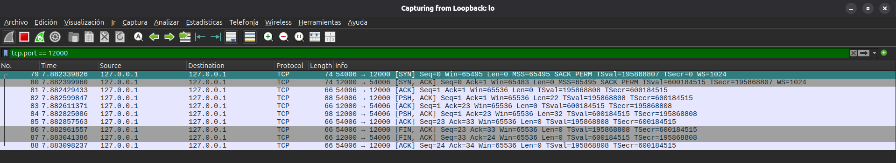

# Ejercicio 4: Servidor TCP mínimo

### c) Ejecución y Captura en Loopback (`lo`)

Filtro utilizado en Wireshark:
```text
tcp.port == 12000
```

#### Salida en Terminal A (Servidor):
```text
[servidor TCP] escuchando en 127.0.0.1:12000 ...
[servidor TCP] conexión aceptada desde 127.0.0.1:54006
[servidor TCP] recibido (22 bytes): 'Hola desde mi programa'
[servidor TCP] respuesta enviada: 'Recibido: Hola desde mi programa'
[servidor TCP] el cliente cerró la conexión
```

#### Salida en Terminal B (Cliente):
```text
[cliente TCP] conectado a 127.0.0.1:12000 desde 127.0.0.1:54006
[cliente TCP] enviado: 'Hola desde mi programa'
[cliente TCP] respuesta (32 bytes): 'Recibido: Hola desde mi programa'
```

#### Captura en Wireshark:


---

### d) Relación entre llamadas a la API de Sockets y Tráfico TCP

| Llamada | ¿Dónde se ejecuta? | ¿Genera tráfico? | Segmentos que observan |
| --- | --- | :---: | --- |
| `socket()` | servidor y cliente | No | Ninguno (operación local, solo crea el socket) |
| `bind()` | servidor | No | Ninguno (asocia IP y puerto a nivel local) |
| `listen()` | servidor | No | Ninguno (habilita la escucha en el puerto) |
| `connect()` | cliente | Sí | Paquetes 79 [SYN], 80 [SYN, ACK] y 81 [ACK] (handshake inicial) |
| `accept()` | servidor | No | Ninguno (el handshake ya lo atendió el sistema operativo) |
| `sendall()` | servidor | Sí | Paquete 84 [PSH, ACK] (envía la respuesta) y 85 [ACK] (confirmación) |
| `recv()` | servidor | No | Ninguno (lee del buffer del socket; los ACK los manda el sistema operativo) |
| `close()` | ambos | Sí | Paquetes 86 [FIN, ACK], 87 [FIN, ACK] y 88 [ACK] (cierre de la conexión) |

