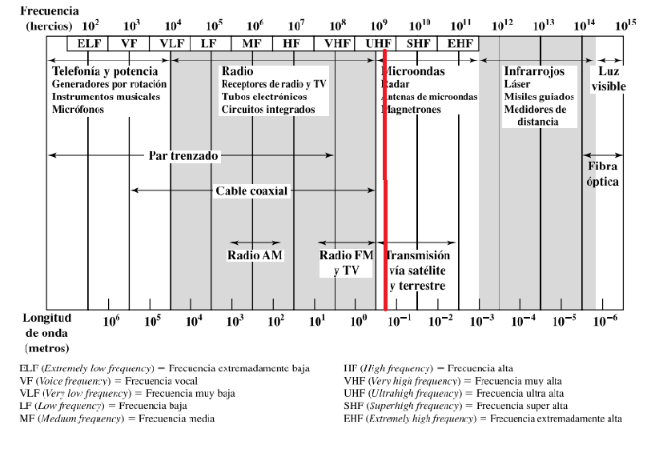
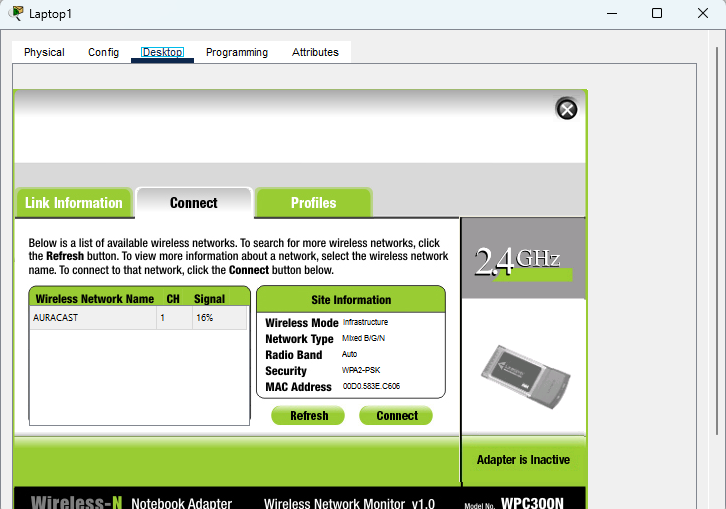
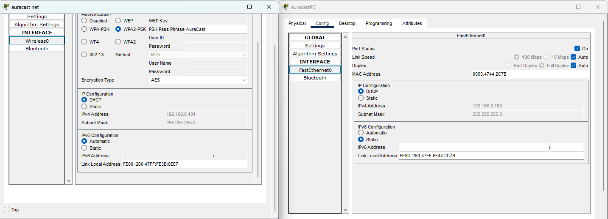
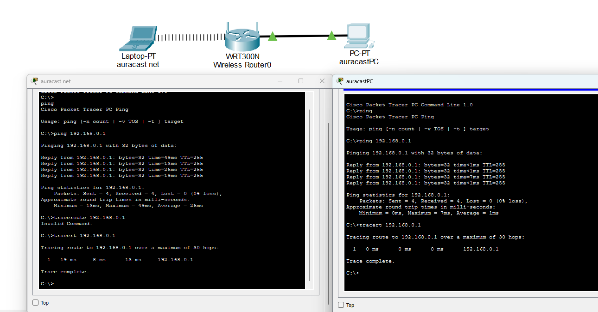
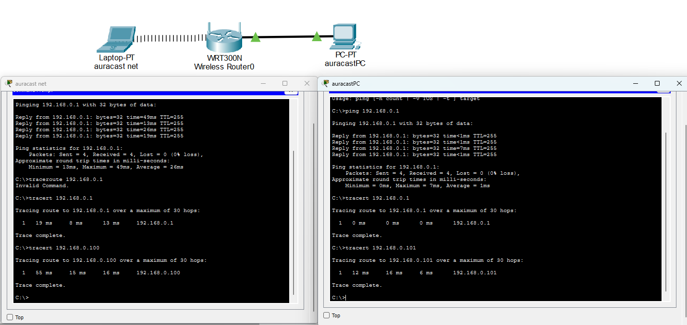
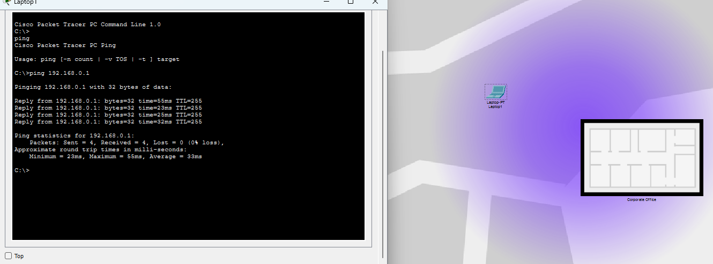
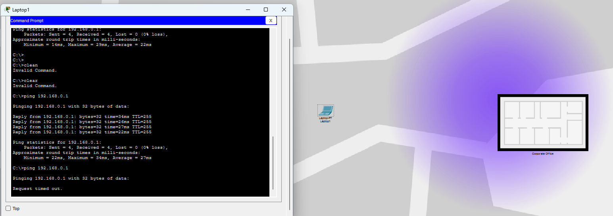
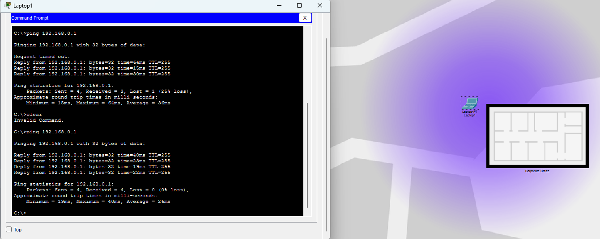

# Red Simple en Packet Tracer

## Inciso a, b, c
El router opera a una frecuencia a una frecuencia de 2.4GHz. Corresponde a la region de Microondas (Transmision via Satélite y Terrestre). Opera entre la banda UHF (Ultrahigh Frequency, 300MHz - 3GHz). Tal y como se detalla en la siguiente imagen.

## Inciso d, e, f
Luego de los pasos "d y e" en los que se tuvo que configurar la placa de red para conectarla al routes a través de un cable, en la imagen que se muestra a continuacion podemos apreciar como se detecto exitosamente la red AURACAST, reconociendo la banda de 2.4GHz y su protocolo de seguridad WPA2-PSK.

## Inciso g
* En esta imagen podemos ver que la interfaz cableada (FastEthernet0) de la PC recibio la IP 192.168.0.100 via DHCP, y la interfaz inalambrica (Wireless0) de la notebook recibio la IP 192.168.0.101.

* En esta se realizo comandos de ping y tracert desde ambas computadoras hacia la direccion del router. Lo que prueba que ambos dispositivos tienen una comunicacion exitosa con el Gateway, y se puede observar las diferencia de latencia entre la conexion a cable (1ms) y de forma inalambrica (26ms).

* Y en esta ultima imagen se hace una comprobacion final de conectividad entre las computadoras. Ejecutamos el comando tracert desde la computadora .100 hacia la .101 y viceversa, mostrando que los paquetes viajan de un dispositivo a otro por medio del router.

## Inciso h
En las proximas 4 imagenes se mostrara la diferencia de atenuacion de la señal que recibe la Laptop mientras mas lejos o cerca este. 
En la primera se podra apreciar el dispositivo a una distancia media de la "oficina" se obtiene una media de 33ms.

En la segunda teniendo a la laptop a una distancia muy lejana de la "oficina" podemos ver que no obtiene datos, por lo que esta ya a perdido su conexion con la red.

Y en esta ultima imagen podemos ver que al tener a la laptop muy cerca esta nos da una media de 26ms siendo la latencia mas baja de las 3 pruebas al estar muy cerca de la "oficina".

